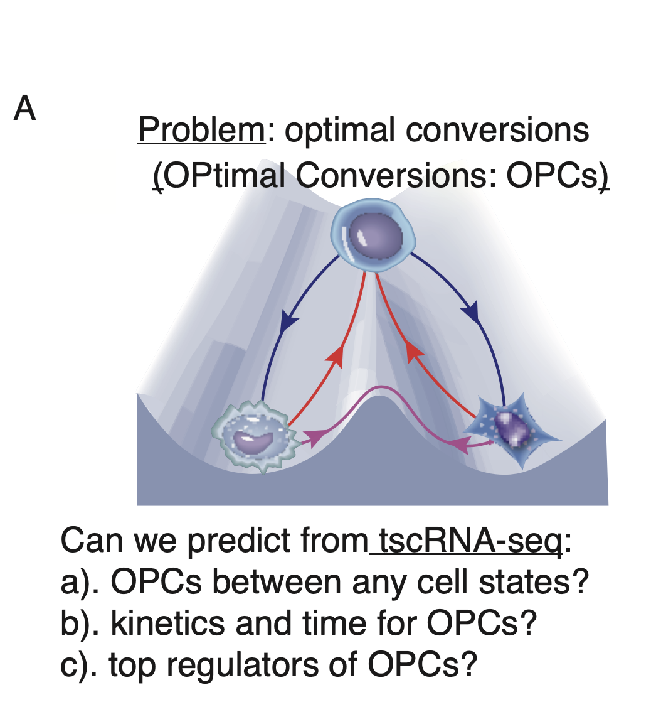
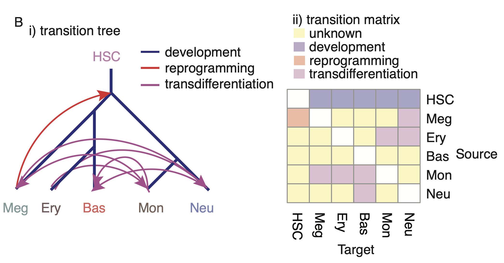
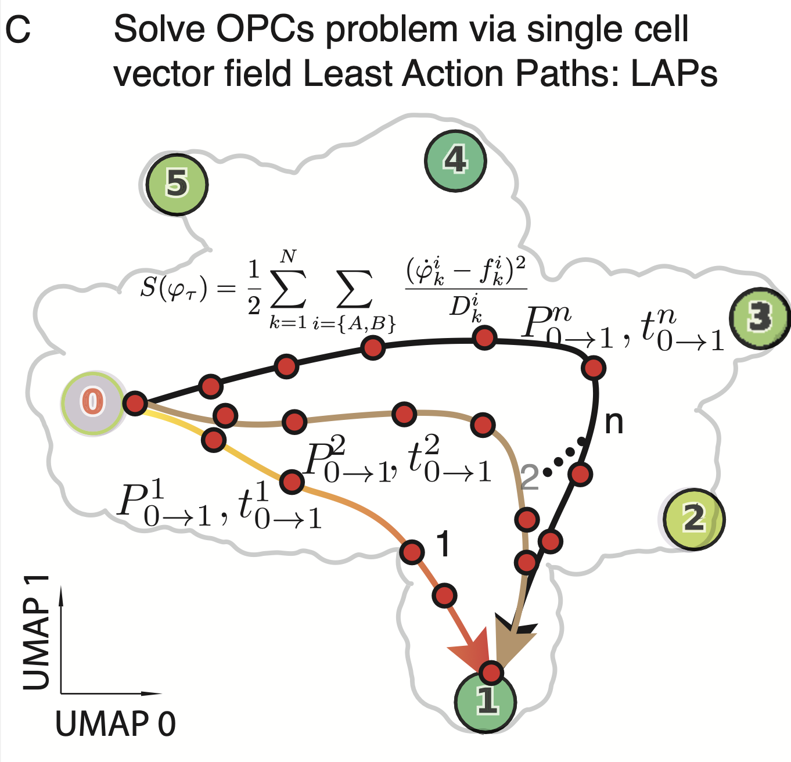

# Optimal cell fate transitions via most probable path

The ability to drive conversion between different cell states has garnered a great deal of attention as a promising avenue for disease modeling. A fundamental challenge in the field of stem cell biology is, thus, to assess the feasibility and identify optimal paths and key transcription factors (TFs) of such inter-conversions. We summarize this grand problem of predicting optimal cell fate conversions (OPCs) in the figure below [here](#lap_theory_dynamo_paper_fig6_a).

{:align="center" width="400"}

The least action path (LAP) principle, first proposed as early as 1744 by [Terrall](#) and famously advocated by Feynman with his reformulation of quantum mechanics via the path integral of the classical Hamilton action [Feynman, 1965](#), has previously been used in predicting the optimal transition path of cell fate transition for simplistic and designed systems [Qiu et al., 2012; Wang et al., 2014; Wang et al., 2017](#). We reason that with the reconstructed continuous and differentiable vector field, we can extend the LAP approach to real datasets in transcriptomic space to computationally explore optimal paths for differentiation and reprogramming (dedifferentiation and transdifferentiation), which then helps us identify key transcription factors whose expression levels vary strongest along these paths.

The hematopoietic scNT-seq dataset we generated in this study is well suited for testing LAP. Among the cell types from our tscRNA-seq data [developmental tree](#lap_theory_dynamo_paper_fig6_b), there are five developmental events (from HSC to each of the terminal cell type), one reported dedifferentiation event (from Meg to HSC), and a total of eight reported transdifferentiation events. Considering all-against-all conversions, we are left with 18 unreported transitions between different mature cell types [transition matrix](#lap_theory_dynamo_paper_fig6_b).



Here we first briefly introduce the intuition of the LAP and what we can do with it. Intuitively, the optimal path between any two cell states (e.g., the fixed point of HSCs and that of megakaryocytes) is searched by varying the continuous path connecting the source state to the target while minimizing its action and updating the associated transition time [LAP](#lap_theory_dynamo_paper_fig6_c). The resultant LAP has the highest transition probability and is associated with a particular transition time. In order to identify the associated key regulators, we focus only on TFs and rank them by the path integral of the mean square displacement (MSD) of gene expression with respect to the initial expression.

{:align="center" width="400"}

Given the vector field function, $\boldsymbol{f}$, optimal pathways of cell fate conversion can be mathematically analyzed by least action paths (LAPs) [Freidlin & Wentzell, 2012; Onsager, 1953; Maier & Stein, 1997](#). The action is defined as:

```math
S_T(\boldsymbol{x}) = \frac{1}{2} \int_{0}^{T}\mathrm{d}t \left(\boldsymbol{v}(t) - \boldsymbol{f}(\boldsymbol{x}(t))\right)^\mathsf{T} \boldsymbol{D}^{-1} \left(\boldsymbol{v}(t) - \boldsymbol{f}(\boldsymbol{x}(t))\right),
```

where $\boldsymbol{x}$ is a path and $\boldsymbol{v}$ is $\boldsymbol{x}$'s tangential velocity (the path is parametrized by time $t$, so $\boldsymbol{v}(t) = \dot{\boldsymbol{x}}(t)$). $\boldsymbol{D}$ is the diffusion coefficient matrix accounting for the stochasticity of gene expression, and for simplicity here we assume it to be a constant. $T$ is the time needed for a cell to traverse the path. By this definition, a path that strictly follows a streamline of a vector field whose tangential velocity also equals the evaluated velocity of the vector field has zero action, whereas any deviation increases action. In other words, developmental processes are (mostly) a spontaneous process and driven by intrinsic cell states, whereas dedifferentiation requires external forces such as ectopic expression of exogenous TFs or specific chemical inductions.

Computationally, given the starting and end cell states $\boldsymbol{x}_0$ and $\boldsymbol{x}_{n}$, such as HSCs and megakaryocytes, and a specific traversal time $T$, the LAP can be found by discretizing the path as a sequence of points $P=\{\boldsymbol{x}_0, \boldsymbol{x}_1, \dots, \boldsymbol{x}_n\}$, which forms $n$ line segments. For each line segment, the discrete tangential velocity can be calculated as $\boldsymbol{v}_k = (\boldsymbol{x}_k-\boldsymbol{x}_{k-1})/\Delta t$, where $\Delta t = T/n$. The action along the discrete path is defined as [Perez-Carrasco et al., 2016; Tang et al., 2017](#):

```math
S_T(P) = \frac{1}{2D}\sum_{k=1}^{n} \left(\boldsymbol{v}_k - \boldsymbol{f}(\boldsymbol{y}_k)\right)^2\Delta t,
```

where $\boldsymbol{y}_k$ are the middle points of the line segments, i.e., $\boldsymbol{y}_k = (\boldsymbol{x}_{k-1} + \boldsymbol{x}_k)/2$. Given a traversal time $T$, the LAP is a path such that:

```math
P^* = \underset{P}{\operatorname{argmin}}\ S_T(P) = \underset{P}{\operatorname{argmin}}\ \frac{1}{2D}\sum_{k=1}^{n} \left(\boldsymbol{v}_k - \boldsymbol{f}(\boldsymbol{y}_k)\right)^2\Delta t.
```

To obtain the global LAP, the optimal traversal time $T^*$ is determined as:

```math
T^* = \underset{T}{\operatorname{argmin}}\ S_T(P).
```

The algorithm discretizes the path as a sequence of points, $P=\{\boldsymbol{x}_0, \boldsymbol{x}_1, \dots, \boldsymbol{x}_n\}$, which forms $n$ line segments. For each line segment, the discrete tangential velocity can be calculated as $\boldsymbol{v}_k=(\boldsymbol{x}_k - \boldsymbol{x}_{k-1})/\Delta t$, where $\Delta t$ is the time step for the cell to move from $\boldsymbol{x}_{k-1}$. In addition to the deterministic vector field, we also assume a certain degree of stochasticity in the system:

```math
\dot{\boldsymbol{x}} = \boldsymbol{f}(\boldsymbol{x}) + \sigma \boldsymbol{\eta}(t),
```

where $\boldsymbol{\eta}(t)$ is a stochastic white noise and $\boldsymbol{\sigma}$ the size of it. The action $S$ along the discrete path is defined as (Perez-Carrasco et al., 2016):

```math
S(P, \Delta t) = \frac{1}{2D}\sum_{k=1}^{n}\left(\boldsymbol{v}_k - \boldsymbol{f}(\boldsymbol{y}_k)\right)^2\Delta t,
```

where $\boldsymbol{y}_k$ are the middle points of the line segments, i.e., $\boldsymbol{y}_k = (\boldsymbol{x}_{k-1} + \boldsymbol{x}_k)/2$. We have also assumed the diffusion matrix to be a constant $D$, such that $D=\sigma^2/2$. It is intuitive that a path whose tangential velocities $\boldsymbol{v}$ align with the vector field has smaller action than paths that do not. The LAP is a path such that:

```math
P^* = \underset{P, \Delta t}{\operatorname{argmin}} S(P, \Delta t) = \underset{P, \Delta t}{\operatorname{argmin}}\frac{1}{2D}\sum_{k=1}^{n}\left(\boldsymbol{v}_k - \boldsymbol{f}(\boldsymbol{y}_k)\right)^2\Delta t,
```

The algorithm for finding the LAP therefore consists of two steps:

- Minimization of the action by varying the time step. The optimal time step given a fixed path is a simple univariate least square minimization, i.e.:

```math
\Delta t^* = \underset{\Delta t}{\operatorname{argmin}}\frac{1}{2D}\sum_{k=1}^{n}\left(\frac{\boldsymbol{x}_k - \boldsymbol{x}_{k-1}}{\Delta t} - \boldsymbol{f}(\boldsymbol{y}_k)\right)^2\Delta t,
```

- Minimization of the action by varying the path without moving the starting and end points. The optimal path given a fixed time step is found by:

```math
P^* = \underset{\{\boldsymbol{x}_1, \boldsymbol{x}_2, \dots, \boldsymbol{x}_{n-1}\}}{\operatorname{argmin}}\frac{1}{2D}\sum_{k=1}^{n}\left(\frac{\boldsymbol{x}_k - \boldsymbol{x}_{k-1}}{\Delta t} - \boldsymbol{f}\left(\frac{\boldsymbol{x}_{k-1} + \boldsymbol{x}_k}{2}\right)\right)^2\Delta t,
```

For a $d$-dimensional vector field, the number of variables in the above optimization problem is $d\times n$. To mitigate the computational cost, the Jacobian of the action w.r.t. the path (more specifically, the a-th component of the $k$-th point) is analytically computed:

```math
\frac{\partial{S}}{\partial{x_k^a}} = \frac{1}{D}\left(v_k^a - v_{k+1}^a + f^a(\boldsymbol{y}_{k+1}) - f^a(\boldsymbol{y}_k)\right) -\frac{1}{2D}\left(\left(\boldsymbol{v}_{k+1} - \boldsymbol{f}(\boldsymbol{x}_{k+1})\right) \cdot \frac{\partial{f}}{\partial{x^a}}\Big|_{\boldsymbol{x}_{k+1}} + \left(\boldsymbol{v}_k - \boldsymbol{f}(\boldsymbol{x}_k)\right)\cdot\frac{\partial f}{\partial{x^a}}\Big|_{\boldsymbol{x}_k}\right)
```

Note that the partial derivative of the vector field is the $a$-th row of the Jacobian of the vector field. With the analytical Jacobian, the computation efficiency of the LAP optimization improves tremendously, making the LAP calculation feasible to operate in high-dimensional space, such as the top 30 PCs.

The LAP is found by iterating between the two steps, and empirically we found that the path converges in two or three iterations. By default, the LAP optimization is initialized with the interpolated shortest path on the kNN graph of cells.

Notably, when LAPs are calculated in the PCA space, we can transform them back to the original gene expression space to predict the full transcriptomic kinetics along the optimal path, inspect waves of those kinetics along the path, and do so in absolute time units when the vector field used is based on tscRNA-seq.

For rare transitions with $S_{T^*} \gg 0$ (e.g., dedifferentiation and transdifferentiation), the transition rate (number of transitions per unit time) is proportional to the exponential of actions of all paths. The Freidlin–Wentzell theorem dictates that the LAP with the minimal traversal time (which will be referred to as the optimal path below) contributes the most to this transition rate [Freidlin & Wentzell, 2012; Onsager, 1953; Maier & Stein, 1997; Aurell et al., 2002](#):

```math
R(A\rightarrow B) \approx C\exp(-S_{T^*}),
```

where $A$ and $B$ are two cell types, $S_{T^*}$ the action of the optimal path, and $C$ a proportional factor. Furthermore, the transition time, or more specifically the mean first passage time (MFPT), is related to the transition rate:

```math
\mathrm{MFPT} = \frac{1}{R(A\rightarrow B)}
```

Therefore, the action of the optimal path predicts both the likelihood and transition time for such rare transitions. Again, most reprogramming experiments take a few weeks or months, depending on the exact initial and terminal cell states [Takahashi & Yamanaka, 2006](#).

For natural transitions between points that are connected by the vector field streamlines (e.g., from a repulsor to an adjacent attractor), the actions of LAPs, within a certain range of $T$, are all zero, because a path following the streamline downstream is a LAP with zero action. The above approximation that the LAP contributes the most to the transition rate no longer applies. Differentiation processes are often close to such natural transitions, and the action of a differentiation LAP cannot tell us any information on the transition rate. However, LAPs are still the most probable paths for cells to take, as they are optimized to follow the streamline of the vector field. The waiting time for the cell to initiate the transition is negligible in this case, so the transition time can be approximated by the traversal time of the LAP.

In addition to the computation of transition time and traversal time (see below), analyzing gene expression variations along LAPs provides essential information on regulatory genes, and their dynamics, during cell fate transitions.

- Transition time: the expected waiting time for a cell to initiate and finish the transition between two states, regardless of the path it takes. This corresponds to the experimentally measured time for one cell type to commit into another.

- Traversal time: the time the cell spends traveling along a specific path. Theoretically, this is the time for a single cell to complete the cell type conversion once the cell has decided on the commitment.

We calculate the mean squared displacement (MSD) for every gene $i$ along the optimal path:

```math
\mathrm{MSD}_i = \sum_{t=0}^{T} \big(y_i(t) - y_i(0)\big)^2
```

Genes with large MSD are potentially genes that regulate the corresponding transitions.