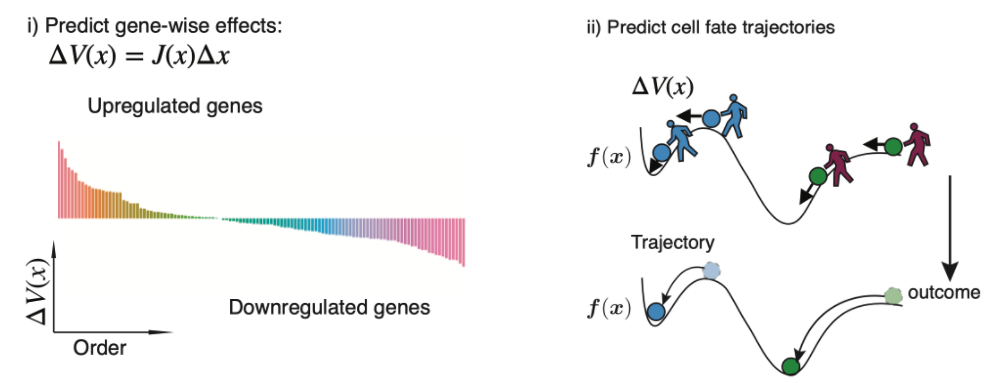

# *In silico* perturbation

\[
\newcommand{\pdv}[2]{\dfrac{\partial #1}{\partial #2}} \newcommand{\trp}{\mathsf{T}}
\]

We leverage the analytical Jacobian of the reconstructed vector field function to make *in silico* genetic perturbations (left panel in [this figure](#dynamo_fig7_a)) and predict cell-fate outcomes after the perturbation (right panel in [this figure](#dynamo_fig7_a)).

{:align="center"}

Intuitively, to simulate the genetic perturbation effects, we will introduce genetic perturbations to the system (encoded by the perturbation vector) and then let the perturbations propagate in the gene regulatory network (encoded by the Jacobian matrix) to execute downstream responses. Mathematically, for gene \(i\) in any cell, the genetic perturbation effects or changes in its velocity (or more accurately, the vector field) w.r.t. to small perturbations in the expression of all genes in the network (encoded by the Jacobian matrix \(\boldsymbol J\)), \(\mathrm dx_1\), \(\mathrm dx_2\),…, \(\mathrm dx_n\), can be calculated with the *exact differential*:

```math
\mathrm{d} f_i = \pdv{f_i}{x_1}\mathrm{d}x_1 + \pdv{f_i}{x_2}\mathrm{d}x_2 + \ldots + \pdv{f_i}{x_n}\mathrm{d}x_n.
```

In vectorized form:

```math
\begin{bmatrix} \mathrm{d}f_1 \\[1.5ex] \mathrm{d}f_2 \\[1.5ex] \dots \\[1.5ex] \mathrm{d}f_n \end{bmatrix} = \begin{bmatrix} \pdv{f_1}{x_1} & \pdv{f_1}{x_2} & \dots & \pdv{f_1}{x_n} \\[2ex] \pdv{f_2}{x_1} & \pdv{f_2}{x_2} & \dots & \pdv{f_2}{x_n} \\[2ex] \dots & \dots & \dots & \dots \\[2ex] \pdv{f_n}{x_1} & \pdv{f_n}{x_2} & \dots & \pdv{f_n}{x_n} \end{bmatrix} \begin{bmatrix} \mathrm{d}x_1 \\[1.5ex] \mathrm{d}x_2 \\[1.5ex] \dots \\[1.5ex] \mathrm{d}x_n \end{bmatrix}.
```

The matrix on the right hand side is the Jacobian of the vector field. Replacing infinitesimal changes with finite perturbations, the above equation becomes:

```math
\Delta \boldsymbol{f} = \boldsymbol{J} \Delta \boldsymbol{x}.
```

In practice, a proportionality constant \(c\) (i.e. setting a perturbation to be 100 or -100) is often added to the perturbation \(\Delta \boldsymbol{x}\) to amplify the response \(\Delta \boldsymbol{f}\). Furthermore, because vector fields are often learned in the PCA space, the perturbations in the \(d\)-dimensional gene space are first transformed to the \(k\)-dimensional PCA space by:

```math
\Delta \boldsymbol{x} = \boldsymbol{Q}^\trp (\Delta \boldsymbol{y} - \boldsymbol{\mu}).
```

where \(\boldsymbol{Q}\) is the \(d\)-by-\(k\) PCA loading matrix, and \(\boldsymbol{\mu}\) is the mean of the PCA-transformed data. The response \(\Delta \boldsymbol{f}\) can be transformed back to the PCA space:

```math
\Delta \boldsymbol{g} = \boldsymbol{Q} \Delta \boldsymbol{f} + \boldsymbol{\mu}.
```

One can then use \(\Delta \boldsymbol{f}\), a gene by cell matrix, to identify the strongest positive or negative responders of the genetic perturbation across cells.

Importantly, because \(\Delta \boldsymbol{f}\) implies how each cell state will be affected after genetic perturbations, we can predict the cell fate trajectory under genetic perturbations by integrating the perturbation effects across cells over gene expression space. To visualize the cell fate trajectory, pairs of \(\boldsymbol{x}\) and \(\Delta \boldsymbol{g}\) are used in the same vein as the gene expression and RNA velocity vector to be further projected onto the UMAP or other low dimensional embeddings using the transition matrix [Bergen et al., 2020; La Manno et al., 2018](#) and then plotted with streamlines.
