.. raw:: html

    

      
      
    

Most probable path predictions
==============================

Introduction
~~~~~~~~~~~~

| The ability to drive conversion between different cell states has
  garnered a great deal of attention as a promising avenue for disease
  modeling. A fundamental challenge in the field
  of stem cell biology is to identify and assess the feasibility of
  optimal paths and key TFs (transcription factors) of such
  interconversions (Figure 6A of :cite:p:`QIU2022`). The least action path (LAP) is a principled method that has previously been used in
  theoretical efforts to predict the most probable path a cell will
  follow during fate transition. Specifically, the optimal path between any two cell states
  (e.g. the fixed point of HSCs and that of megakaryocytes) is searched
  by variating the continuous path connecting the source state to the
  target while minimizing its action and updating the associated
  transition time. The resultant least action path has the highest
  transition probability and is associated with a particular transition
  time. Once the LAP is identified, we can focus only on TFs and rank them by the path integral of the mean square displacement (MSD) of gene expression with respect to the initial expression to identify key transcription factors of the associated cell fate transitions.

| In this tutorial, we will demonstrate how to 
- perform LAP analyses;
- visualize transition paths found by the LAP approach on the vector field;
- plot heatmaps of actions and transition times matrix between all hematopoietic cell types;
- prioritize transcription factors of each predicted optimal path;
- ROC analyses of the LAP predictions.

Import relevant packages

.. code:: ipython3

    import numpy as np
    import pandas as pd
    import seaborn as sns
    import matplotlib.pyplot
    import matplotlib.pyplot as plt
    
    import sys
    import os
    
    import dynamo as dyn
    
    dyn.dynamo_logger.main_silence()

.. parsed-literal::

    |-----> setting visualization default mode in dynamo. Your customized matplotlib settings might be overritten.

Let us first load the human hematopoiesis scNT-seq dataset, which has stored as a sample dataset within dynamo that can be download directly using the above function, produced in this study (:cite:p:`QIU2022`). In this tutorial we will focus on analyzing this scNT-seq dataset because decades of researches in hematopoiesis make it a well suited system for testing LAP predictions. 

.. code:: ipython3

    adata_labeling = dyn.sample_data.hematopoiesis()

Let us take a glance at what is in ``adata`` object. Preprocessing, normalization, umap dimension reduction, total RNA velocity, as well as the continous RNA velocity vector field are computed (notebooks on these operations will be released shortly. Please also check other existing notebooks for these operations). 

.. code:: ipython3

    adata_labeling

.. parsed-literal::

    AnnData object with n_obs × n_vars = 1947 × 1956
        obs: 'batch', 'time', 'cell_type', 'nGenes', 'nCounts', 'pMito', 'pass_basic_filter', 'new_Size_Factor', 'initial_new_cell_size', 'total_Size_Factor', 'initial_total_cell_size', 'spliced_Size_Factor', 'initial_spliced_cell_size', 'unspliced_Size_Factor', 'initial_unspliced_cell_size', 'Size_Factor', 'initial_cell_size', 'ntr', 'cell_cycle_phase', 'leiden', 'umap_leiden', 'umap_louvain', 'control_point_pca', 'inlier_prob_pca', 'obs_vf_angle_pca', 'pca_ddhodge_div', 'pca_ddhodge_potential', 'umap_ddhodge_div', 'umap_ddhodge_potential', 'curl_umap', 'divergence_umap', 'control_point_umap', 'inlier_prob_umap', 'obs_vf_angle_umap', 'acceleration_pca', 'curvature_pca', 'n_counts', 'mt_frac', 'jacobian_det_pca', 'manual_selection', 'divergence_pca', 'curvature_umap', 'acceleration_umap', 'control_point_umap', 'inlier_prob_umap', 'obs_vf_angle_umap', 'curvature_umap', 'curv_leiden', 'curv_louvain', 'SPI1->GATA1_jacobian', 'jacobian'
        var: 'gene_name', 'gene_id', 'nCells', 'nCounts', 'pass_basic_filter', 'use_for_pca', 'frac', 'ntr', 'time_3_alpha', 'time_3_beta', 'time_3_gamma', 'time_3_half_life', 'time_3_alpha_b', 'time_3_alpha_r2', 'time_3_gamma_b', 'time_3_gamma_r2', 'time_3_gamma_logLL', 'time_3_delta_b', 'time_3_delta_r2', 'time_3_bs', 'time_3_bf', 'time_3_uu0', 'time_3_ul0', 'time_3_su0', 'time_3_sl0', 'time_3_U0', 'time_3_S0', 'time_3_total0', 'time_3_beta_k', 'time_3_gamma_k', 'time_5_alpha', 'time_5_beta', 'time_5_gamma', 'time_5_half_life', 'time_5_alpha_b', 'time_5_alpha_r2', 'time_5_gamma_b', 'time_5_gamma_r2', 'time_5_gamma_logLL', 'time_5_bs', 'time_5_bf', 'time_5_uu0', 'time_5_ul0', 'time_5_su0', 'time_5_sl0', 'time_5_U0', 'time_5_S0', 'time_5_total0', 'time_5_beta_k', 'time_5_gamma_k', 'use_for_dynamics', 'gamma', 'gamma_r2', 'use_for_transition', 'gamma_k', 'gamma_b'
        uns: 'PCs', 'VecFld_pca', 'VecFld_umap', 'VecFld_umap', 'X_umap_neighbors', 'cell_phase_genes', 'cell_type_colors', 'dynamics', 'explained_variance_ratio_', 'feature_selection', 'grid_velocity_pca', 'grid_velocity_umap', 'grid_velocity_umap', 'grid_velocity_umap_perturbation', 'grid_velocity_umap_test', 'grid_velocity_umap_perturbation', 'jacobian_pca', 'leiden', 'neighbors', 'pca_mean', 'pp', 'response'
        obsm: 'X', 'X_pca', 'X_pca_SparseVFC', 'X_umap', 'X_umap_SparseVFC', 'X_umap', 'X_umap_SparseVFC', 'X_umap_perturbation', 'X_umap_test', 'X_umap_perturbation', 'acceleration_pca', 'acceleration_umap', 'cell_cycle_scores', 'curvature_pca', 'curvature_umap', 'curvature_umap', 'j_delta_x_perturbation', 'velocity_pca', 'velocity_pca_SparseVFC', 'velocity_umap', 'velocity_umap_SparseVFC', 'velocity_umap', 'velocity_umap_SparseVFC', 'velocity_umap_perturbation', 'velocity_umap_test', 'velocity_umap_perturbation'
        layers: 'M_n', 'M_nn', 'M_t', 'M_tn', 'M_tt', 'X_new', 'X_total', 'velocity_alpha_minus_gamma_s'
        obsp: 'X_umap_connectivities', 'X_umap_distances', 'connectivities', 'cosine_transition_matrix', 'distances', 'fp_transition_rate', 'moments_con', 'pca_ddhodge', 'perturbation_transition_matrix', 'umap_ddhodge'

We will first show the streamline plot of this dataset in the UMAP space. From which, we can see that we have six major cell types, namely hematopoietic stem cells (HSC), neutrophil (Neu), monocyte (Mon), basophil (Bas), megakaryocyte (Meg) and erythrocytes (Ery). From the streamline plot, we can see that HSC will first become GMP (granulocyte monocyte progenitor)-like or MEP (megakaryocyte and erythrocyte progenitor)-like cells and then bifurcate into Neu and Mon or Ery, Bas and Meg, respectively. Here we will select a few characteristic cells for each specific cell type via ``dyn.tl.select_cell``.

Among the cell types from our tscRNA-seq data, there are five developmental events (from HSC to each of the terminal cell type), one reported dedifferentiation event (from Meg to HSC), and a total of eight reported transdifferentiation events. Considering all-against-all conversions, we are left with 18 unreported transitions between different mature cell types. Thus, this system provides a broad range of known transitions and associated transcription factors to confirm our predictions while also allows us to make non-trivial predictions for the remaining 18 unreported transitions.  

.. code:: ipython3

    dyn.pl.streamline_plot(adata_labeling, basis="umap", color="cell_type")

    HSC_cells = dyn.tl.select_cell(adata_labeling, "cell_type", "HSC")
    Meg_cells = dyn.tl.select_cell(adata_labeling, "cell_type", "Meg")
    Ery_cells = dyn.tl.select_cell(adata_labeling, "cell_type", "Ery")
    Bas_cells = dyn.tl.select_cell(adata_labeling, "cell_type", "Bas")
    Mon_cells = dyn.tl.select_cell(adata_labeling, "cell_type", "Mon")
    Neu_cells = dyn.tl.select_cell(adata_labeling, "cell_type", "Neu")
    

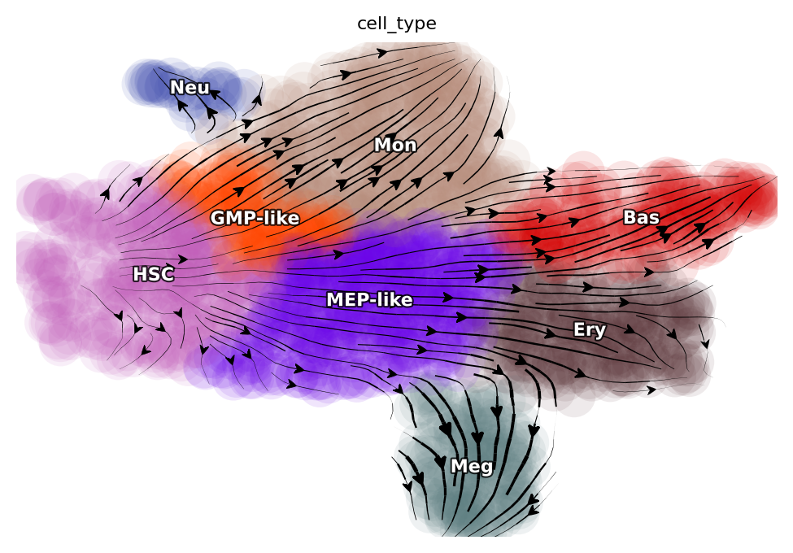

| We select the five closest cells of the identified fixed_points that correspond to each of the six cell types to represent the typical cell state of these cells (note that fixed_points often don't correspond to any particular cell).

| Then nearest cells of these ``fixed_points`` are saved to
  ``*_cells_indices variables``, which points to their cell indices in
  the adata object. Note that we could just take the fixed_points for LAP analyses but using the actual cells offering us the benefits to take advantage of the nearest neighbor graph of cells to intialize the searching of LAP (see below). 

.. code:: ipython3

    from dynamo.tools.utils import nearest_neighbors
    
    fixed_points = np.array(
        [
            [8.45201833, 9.37697661],
            [14.00630381, 2.53853712],
            [17.30550636, 6.81561775],
            [18.06891717, 11.9840678],
            [14.13613403, 15.22244713],
            [9.72644402, 14.83745969],
        ]
    )
    
    HSC_cells_indices = nearest_neighbors(fixed_points[0], adata_labeling.obsm["X_umap"])
    Meg_cells_indices = nearest_neighbors(fixed_points[1], adata_labeling.obsm["X_umap"])
    Ery_cells_indices = nearest_neighbors(fixed_points[2], adata_labeling.obsm["X_umap"])
    Bas_cells_indices = nearest_neighbors(fixed_points[3], adata_labeling.obsm["X_umap"])
    Mon_cells_indices = nearest_neighbors(fixed_points[4], adata_labeling.obsm["X_umap"])
    Neu_cells_indices = nearest_neighbors(fixed_points[5], adata_labeling.obsm["X_umap"])

.. code:: ipython3

    import matplotlib.pyplot as plt
    
    # plt.figure(figsize=(4, 4))
    
    plt.scatter(*adata_labeling.obsm["X_umap"].T)
    for indices in [
        HSC_cells_indices,
        Meg_cells_indices,
        Ery_cells_indices,
        Bas_cells_indices,
        Mon_cells_indices,
        Neu_cells_indices,
    ]:
        plt.scatter(*adata_labeling[indices[0]].obsm["X_umap"].T)

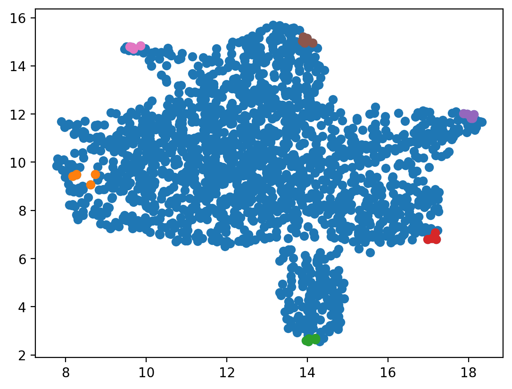

We can see, for example, the cell indices ``1587, 1557, 1725, 1091, 1070`` are the nearest cells to the identified HSC attractor. 

.. code:: ipython3

    HSC_cells_indices

.. parsed-literal::

    array([[1587, 1557, 1725, 1091, 1070]])

.. 
    Development path for Meg, Ery, Bas, Mon and Neu cells
    -----------------------------------------------------

Now we are ready to perform the LAP analyses. We will start with computing the neighbor graph of cells in the umap space (pca space works too) and use the shortest paths between any two represented cells as the initial guess of the LAP. We will next run the LAP analyses between all pair-wise combinations of cells. We can either perform the LAP analyses on the UMAP space or in the PCA space, using the vector field reconstructed in UMAP or PCA space, respectively. With the vector field learned in the PCA space, we can further projected the optimized LAP back to the original gene expression space to reveal the transcriptomic kinetics along the LAP. 

Compute neighbor graph based on ``umap``
~~~~~~~~~~~~~~~~~~~~~~~~~~~~~~~~~~~~~~~~~~~~

.. code:: ipython3

    dyn.tl.neighbors(adata_labeling, basis="umap", result_prefix="umap")

.. parsed-literal::

    |-----> Start computing neighbor graph...
    |-----------> X_data is None, fetching or recomputing...
    |-----> fetching X data from layer:None, basis:umap
    |-----> method arg is None, choosing methods automatically...
    |-----------> method kd_tree selected
    |-----> <insert> umap_connectivities to obsp in AnnData Object.
    |-----> <insert> umap_distances to obsp in AnnData Object.
    |-----> <insert> umap_neighbors to uns in AnnData Object.
    |-----> <insert> umap_neighbors.indices to uns in AnnData Object.
    |-----> <insert> umap_neighbors.params to uns in AnnData Object.

Run pairwise least action path analyses among six distinct hematopoietic cell types
~~~~~~~~~~~~~~~~~~~~~~~~~~~~~~~~~~~~~~~~~~~~~~~~~~~~~~~~~~~~~~~~~~~~~~~~~~~~~~~~~~~~

This section will demonstrate how to compute LAPs for all possible cell type transition pairs in our scNT-seq dataset. The corresponding function in
*dynamo* is ``dyn.pd.least_action``. This function takes an ``adata`` object that has continous vector field reconstructed, a start
cell and a target cell to compute least action path or most probable path between them. As shown
above, either UMAP or PCA basis can be used. Here we use the UMAP basis to visualize the LAP and the PCA basis 
for downstream transcription factor prioritization and other analyses.

Note that the following block also demonstrates using the `GeneTrajectory` function to reverse project the optimized LAP in PCA space back to the original gene expression space to reveal the transcriptomic kinetics along the LAP. We then calculate the accumulative MSD (mean square displacement) with respect to the initial state of each gene along the LAP in the original gene expression space (with `calc_msd` function) and use this score to prioritize the importance of each gene (with `rank_genes` function). Genes with top MSD have higher variances with respect to the initial state and will be ranked higher, which may also indicate key roles in making the cell fate conversions. 

Please refer to the API documentation of each of these functions for
detailed explanation of their input parameters, output, etc. Please also check our primers on the optimal path and the Cell paper for more in-depth understandings. 

.. code:: ipython3

    %%capture
    
    dyn.dynamo_logger.main_silence()
    transition_graph = {}
    cell_type = ["HSC", "Meg", "Ery", "Bas", "Mon", "Neu"]
    start_cell_indices = [
        HSC_cells_indices,
        Meg_cells_indices,
        Ery_cells_indices,
        Bas_cells_indices,
        Mon_cells_indices,
        Neu_cells_indices,
    ]
    end_cell_indices = start_cell_indices
    for i, start in enumerate(start_cell_indices):
        for j, end in enumerate(end_cell_indices):
            if start is not end:
                min_lap_t = True if i == 0 else False
                dyn.pd.least_action(
                    adata_labeling,
                    [adata_labeling.obs_names[start[0]][0]],
                    [adata_labeling.obs_names[end[0]][0]],
                    basis="umap",
                    adj_key="X_umap_distances",
                    min_lap_t= min_lap_t,
                    EM_steps=2,
                )
                dyn.pl.least_action(adata_labeling, basis="umap")
                lap = dyn.pd.least_action(
                    adata_labeling,
                    [adata_labeling.obs_names[start[0]][0]],
                    [adata_labeling.obs_names[end[0]][0]],
                    basis="pca",
                    adj_key="cosine_transition_matrix",
                    min_lap_t=min_lap_t,
                    EM_steps=2,
                )
                dyn.pl.kinetic_heatmap(
                    adata_labeling,
                    basis="pca",
                    mode="lap",
                    genes=adata_labeling.var_names[adata_labeling.var.use_for_transition],
                    project_back_to_high_dim=True,
                )
                # The `GeneTrajectory` class can be used to output trajectories for any set of genes of interest
                gtraj = dyn.pd.GeneTrajectory(adata_labeling)
                gtraj.from_pca(lap.X, t=lap.t)
                gtraj.calc_msd()
                ranking = dyn.vf.rank_genes(adata_labeling, "traj_msd")
    
                print(start, "->", end)
                genes = ranking[:5]["all"].to_list()
                arr = gtraj.select_gene(genes)
    
                dyn.pl.multiplot(lambda k: [plt.plot(arr[k, :]), plt.title(genes[k])], np.arange(len(genes)))
    
                transition_graph[cell_type[i] + "->" + cell_type[j]] = {
                    "lap": lap,
                    "LAP_umap": adata_labeling.uns["LAP_umap"],
                    "LAP_pca": adata_labeling.uns["LAP_pca"],
                    "ranking": ranking,
                    "gtraj": gtraj,
                }

.. parsed-literal::

    |-----> [iterating through 1 pairs] in progress: 100.0000%
    |-----> [iterating through 1 pairs] finished [4.8274s]
    |-----> [iterating through 1 pairs] in progress: 100.0000%
    |-----> [iterating through 1 pairs] finished [87.3331s]
    |-----> [iterating through 1 pairs] in progress: 100.0000%
    |-----> [iterating through 1 pairs] finished [6.1928s]
    |-----> [iterating through 1 pairs] in progress: 100.0000%
    |-----> [iterating through 1 pairs] finished [87.8599s]
    |-----> [iterating through 1 pairs] in progress: 100.0000%
    |-----> [iterating through 1 pairs] finished [6.2292s]
    |-----> [iterating through 1 pairs] in progress: 100.0000%
    |-----> [iterating through 1 pairs] finished [81.9887s]
    |-----> [iterating through 1 pairs] in progress: 100.0000%
    |-----> [iterating through 1 pairs] finished [5.9224s]
    |-----> [iterating through 1 pairs] in progress: 100.0000%
    |-----> [iterating through 1 pairs] finished [82.8575s]
    |-----> [iterating through 1 pairs] in progress: 100.0000%
    |-----> [iterating through 1 pairs] finished [4.7673s]
    |-----> [iterating through 1 pairs] in progress: 100.0000%
    |-----> [iterating through 1 pairs] finished [120.9742s]
    |-----> [iterating through 1 pairs] in progress: 100.0000%
    |-----> [iterating through 1 pairs] finished [0.3654s]
    |-----> [iterating through 1 pairs] in progress: 100.0000%
    |-----> [iterating through 1 pairs] finished [17.5986s]
    |-----> [iterating through 1 pairs] in progress: 100.0000%
    |-----> [iterating through 1 pairs] finished [0.3836s]
    |-----> [iterating through 1 pairs] in progress: 100.0000%
    |-----> [iterating through 1 pairs] finished [17.3726s]
    |-----> [iterating through 1 pairs] in progress: 100.0000%
    |-----> [iterating through 1 pairs] finished [0.4288s]
    |-----> [iterating through 1 pairs] in progress: 100.0000%
    |-----> [iterating through 1 pairs] finished [20.0245s]
    |-----> [iterating through 1 pairs] in progress: 100.0000%
    |-----> [iterating through 1 pairs] finished [0.5213s]
    |-----> [iterating through 1 pairs] in progress: 100.0000%
    |-----> [iterating through 1 pairs] finished [17.8978s]
    |-----> [iterating through 1 pairs] in progress: 100.0000%
    |-----> [iterating through 1 pairs] finished [0.4509s]
    |-----> [iterating through 1 pairs] in progress: 100.0000%
    |-----> [iterating through 1 pairs] finished [27.8622s]
    |-----> [iterating through 1 pairs] in progress: 100.0000%
    |-----> [iterating through 1 pairs] finished [0.4895s]
    |-----> [iterating through 1 pairs] in progress: 100.0000%
    |-----> [iterating through 1 pairs] finished [16.6043s]
    |-----> [iterating through 1 pairs] in progress: 100.0000%
    |-----> [iterating through 1 pairs] finished [0.3779s]
    |-----> [iterating through 1 pairs] in progress: 100.0000%
    |-----> [iterating through 1 pairs] finished [12.5543s]
    |-----> [iterating through 1 pairs] in progress: 100.0000%
    |-----> [iterating through 1 pairs] finished [0.4918s]
    |-----> [iterating through 1 pairs] in progress: 100.0000%
    |-----> [iterating through 1 pairs] finished [21.3984s]
    |-----> [iterating through 1 pairs] in progress: 100.0000%
    |-----> [iterating through 1 pairs] finished [0.6045s]
    |-----> [iterating through 1 pairs] in progress: 100.0000%
    |-----> [iterating through 1 pairs] finished [18.5405s]
    |-----> [iterating through 1 pairs] in progress: 100.0000%
    |-----> [iterating through 1 pairs] finished [0.6157s]
    |-----> [iterating through 1 pairs] in progress: 100.0000%
    |-----> [iterating through 1 pairs] finished [21.0733s]
    |-----> [iterating through 1 pairs] in progress: 100.0000%
    |-----> [iterating through 1 pairs] finished [0.6774s]
    |-----> [iterating through 1 pairs] in progress: 100.0000%
    |-----> [iterating through 1 pairs] finished [28.5954s]
    |-----> [iterating through 1 pairs] in progress: 100.0000%
    |-----> [iterating through 1 pairs] finished [0.4858s]
    |-----> [iterating through 1 pairs] in progress: 100.0000%
    |-----> [iterating through 1 pairs] finished [22.6107s]
    |-----> [iterating through 1 pairs] in progress: 100.0000%
    |-----> [iterating through 1 pairs] finished [0.3991s]
    |-----> [iterating through 1 pairs] in progress: 100.0000%
    |-----> [iterating through 1 pairs] finished [23.0945s]
    |-----> [iterating through 1 pairs] in progress: 100.0000%
    |-----> [iterating through 1 pairs] finished [0.5327s]
    |-----> [iterating through 1 pairs] in progress: 100.0000%
    |-----> [iterating through 1 pairs] finished [24.0878s]
    |-----> [iterating through 1 pairs] in progress: 100.0000%
    |-----> [iterating through 1 pairs] finished [0.6087s]
    |-----> [iterating through 1 pairs] in progress: 100.0000%
    |-----> [iterating through 1 pairs] finished [24.2374s]
    |-----> [iterating through 1 pairs] in progress: 100.0000%
    |-----> [iterating through 1 pairs] finished [0.5198s]
    |-----> [iterating through 1 pairs] in progress: 100.0000%
    |-----> [iterating through 1 pairs] finished [18.8253s]
    |-----> [iterating through 1 pairs] in progress: 100.0000%
    |-----> [iterating through 1 pairs] finished [0.6873s]
    |-----> [iterating through 1 pairs] in progress: 100.0000%
    |-----> [iterating through 1 pairs] finished [14.9045s]
    |-----> [iterating through 1 pairs] in progress: 100.0000%
    |-----> [iterating through 1 pairs] finished [0.5671s]
    |-----> [iterating through 1 pairs] in progress: 100.0000%
    |-----> [iterating through 1 pairs] finished [10.4933s]
    |-----> [iterating through 1 pairs] in progress: 100.0000%
    |-----> [iterating through 1 pairs] finished [0.4429s]
    |-----> [iterating through 1 pairs] in progress: 100.0000%
    |-----> [iterating through 1 pairs] finished [13.5975s]
    |-----> [iterating through 1 pairs] in progress: 100.0000%
    |-----> [iterating through 1 pairs] finished [0.3534s]
    |-----> [iterating through 1 pairs] in progress: 100.0000%
    |-----> [iterating through 1 pairs] finished [19.1570s]
    |-----> [iterating through 1 pairs] in progress: 100.0000%
    |-----> [iterating through 1 pairs] finished [0.5459s]
    |-----> [iterating through 1 pairs] in progress: 100.0000%
    |-----> [iterating through 1 pairs] finished [30.7210s]
    |-----> [iterating through 1 pairs] in progress: 100.0000%
    |-----> [iterating through 1 pairs] finished [0.6741s]
    |-----> [iterating through 1 pairs] in progress: 100.0000%
    |-----> [iterating through 1 pairs] finished [17.5307s]
    |-----> [iterating through 1 pairs] in progress: 100.0000%
    |-----> [iterating through 1 pairs] finished [0.5748s]
    |-----> [iterating through 1 pairs] in progress: 100.0000%
    |-----> [iterating through 1 pairs] finished [22.9212s]
    |-----> [iterating through 1 pairs] in progress: 100.0000%
    |-----> [iterating through 1 pairs] finished [0.5324s]
    |-----> [iterating through 1 pairs] in progress: 100.0000%
    |-----> [iterating through 1 pairs] finished [18.0897s]
    |-----> [iterating through 1 pairs] in progress: 100.0000%
    |-----> [iterating through 1 pairs] finished [0.4742s]
    |-----> [iterating through 1 pairs] in progress: 100.0000%
    |-----> [iterating through 1 pairs] finished [29.8258s]

The LAPs between all pairs of cell types are stored in the `transition_graph` object. Here we will use the LAP results to visualize the developmental, reprogram and transdifferentiation least action paths. Interestingly, we show that the LAP is not simply the shortest paths between two cell states but instead follow the curved vector field flow. 

Visualize developmental LAPs
----------------------------

.. code:: ipython3

    develope_keys = ["HSC->Meg", "HSC->Ery", "HSC->Bas", "HSC->Mon", "HSC->Neu"]
    reprogram_keys = ["Meg->HSC", "Ery->HSC", "Bas->HSC", "Mon->HSC", "Neu->HSC"]
    transdifferentiation = [
        "Ery->Meg",
        "Neu->Bas",
        "Mon->Ery",
        "Bas->Meg",
        "Neu->Meg",
        "Meg->Bas",
        "Mon->Bas",
        "Neu->Mon",
        "Meg->Ery",
        "Ery->Bas",
        "Bas->Mon",
        "Mon->Neu",
        "Neu->Ery",
        "Mon->Meg",
        "Bas->Neu",
        "Meg->Neu",
        "Ery->Mon",
        "Meg->Mon",
        "Ery->Neu",
        "Bas->Ery",
    ]

We define a helper function ``plot_lap`` to visualize different set of paths. Here we visualize developmental LAPs.

.. code:: ipython3

    from dynamo.plot.utils import map2color
    def plot_lap(paths):
        fig, ax = plt.subplots(figsize=(5, 4))
        ax = dyn.pl.streamline_plot(
            adata_labeling, basis="umap", save_show_or_return="return", ax=ax, color="cell_type", frontier=True
        )
        ax = ax[0]
        x, y = 0, 1

        # plot paths
        for path in paths:
            lap_dict = transition_graph[path]["LAP_umap"]
            for prediction, action in zip(lap_dict["prediction"], lap_dict["action"]):
                ax.scatter(*prediction[:, [x, y]].T, c=map2color(action))
                ax.plot(*prediction[:, [x, y]].T, c="k")
    plot_lap(develope_keys)

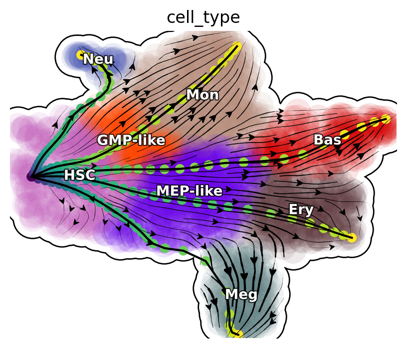

**Reprogram LAPs**

.. code:: ipython3

    plot_lap(reprogram_keys)

.. image:: reprogram-lap.png
   :width: 407px

**Transdifferentiation LAPs**

.. code:: ipython3

    plot_lap(transdifferentiation)

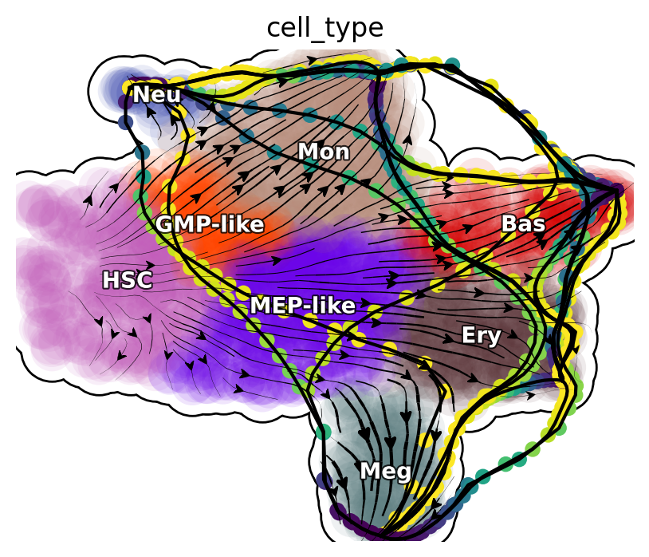

Next, we will focus on transcription factors (TFs) and rank them based on their MSD along the LAP path to prioritize the importance of each TF. Meanwhile, we will also keep the action (an functional of the LAP) and the least action path time, with `action_df` and `t_df`, respectively, of each of these conversions. 

.. code:: ipython3

    human_tfs = dyn.sample_data.human_tfs()
    human_tfs_names = list(human_tfs["Symbol"])

.. code:: ipython3

    action_df = pd.DataFrame(index=cell_type, columns=cell_type)
    t_df = pd.DataFrame(index=cell_type, columns=cell_type)
    for i, start in enumerate(
        [
            HSC_cells_indices,
            Meg_cells_indices,
            Ery_cells_indices,
            Bas_cells_indices,
            Mon_cells_indices,
            Neu_cells_indices,
        ]
    ):
        for j, end in enumerate(
            [
                HSC_cells_indices,
                Meg_cells_indices,
                Ery_cells_indices,
                Bas_cells_indices,
                Mon_cells_indices,
                Neu_cells_indices,
            ]
        ):
            if start is not end:
                print(cell_type[i] + "->" + cell_type[j], end=",")
                lap = transition_graph[cell_type[i] + "->" + cell_type[j]]["lap"]  # lap
                gtraj = transition_graph[cell_type[i] + "->" + cell_type[j]]["gtraj"]
                ranking = transition_graph[cell_type[i] + "->" + cell_type[j]]["ranking"].copy()
                ranking["TF"] = [i in human_tfs_names for i in list(ranking["all"])]
                genes = ranking.query("TF == True").head(10)["all"].to_list()
                arr = gtraj.select_gene(genes)
                action_df.loc[cell_type[i], cell_type[j]] = lap.action()[-1]
                t_df.loc[cell_type[i], cell_type[j]] = lap.t[-1]

.. parsed-literal::

    HSC->Meg,HSC->Ery,HSC->Bas,HSC->Mon,HSC->Neu,Meg->HSC,Meg->Ery,Meg->Bas,Meg->Mon,Meg->Neu,Ery->HSC,Ery->Meg,Ery->Bas,Ery->Mon,Ery->Neu,Bas->HSC,Bas->Meg,Bas->Ery,Bas->Mon,Bas->Neu,Mon->HSC,Mon->Meg,Mon->Ery,Mon->Bas,Mon->Neu,Neu->HSC,Neu->Meg,Neu->Ery,Neu->Bas,Neu->Mon,

We now visualize the LAP time of all developmental LAPs. Interestingly, we show that the LAP time from HSC to Meg lineage LAP (28 hour) is the shortest among all
developmental LAPs, consistent with the fact that megakaryocyte is the earliest cell type to appear. The predicted 28 hours is also on the time-scale of what has been reported for the single HSC transplantation experiments. We want to note that because we used the metabolic labeling based scRNA-seq, we obtained absolute RNA velocity and thus we can predict the actual time (with units of hour) of the LAP, a rather remarkable feature of the labeling data. 

.. code:: ipython3

    dyn.configuration.set_pub_style(scaler=1.5)
    develop_time_df = pd.DataFrame({"integration time": t_df.iloc[0, :].T})
    develop_time_df["lineage"] = ["HSC", "Meg", "Ery", "Bas", "Mon", "Neu"]
    print(develop_time_df)
    ig, ax = plt.subplots(figsize=(4, 3))
    dynamo_color_dict = {
        "Mon": "#b88c7a",
        "Meg": "#5b7d80",
        "MEP-like": "#6c05e8",
        "Ery": "#5d373b",
        "Bas": "#d70000",
        "GMP-like": "#ff4600",
        "HSC": "#c35dbb",
        "Neu": "#2f3ea8",
    }
    
    sns.barplot(
        y="lineage",
        x="integration time",
        hue="lineage",
        data=develop_time_df.iloc[1:, :],
        dodge=False,
        palette=dynamo_color_dict,
        ax=ax,
    )
    ax.set_ylabel("")
    plt.tight_layout()
    plt.legend(bbox_to_anchor=(1.05, 1), loc="upper left")

.. parsed-literal::

        integration time lineage
    HSC              NaN     HSC
    Meg        28.335868     Meg
    Ery        46.227644     Ery
    Bas        45.575254     Bas
    Mon        41.797433     Mon
    Neu        76.469544     Neu

.. parsed-literal::

    <matplotlib.legend.Legend at 0x7f7f02026eb0>

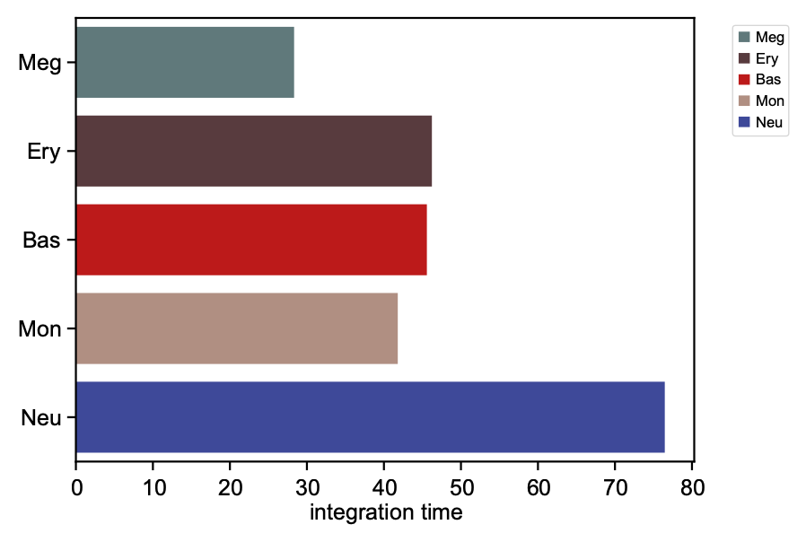

Here we are going to visualize the transition matrices of actions and LAP time between all pair-wise cell type conversions with heatmaps. Overall, we find the the developmental LAP time is much larger than that of the dedifferentiation LAP while the action has the opposite pattern. 

Heatmap of LAP actions and LAP time matrices of pairwise cell fate conversions
-------------------------------------------------------------------------------

.. code:: ipython3

    action_df = action_df.fillna(0)
    f, ax = plt.subplots(figsize=(5, 5))
    dyn.configuration.set_pub_style(scaler=3)
    ax = sns.heatmap(action_df, annot=True, ax=ax, fmt=".2g")

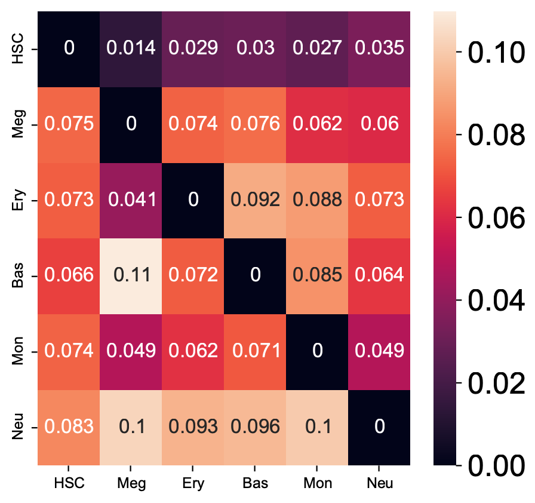

.. code:: ipython3

    t_df = t_df.fillna(0)
    dyn.configuration.set_pub_style(scaler=3)
    ax = sns.heatmap(t_df, annot=True, fmt=".3g")

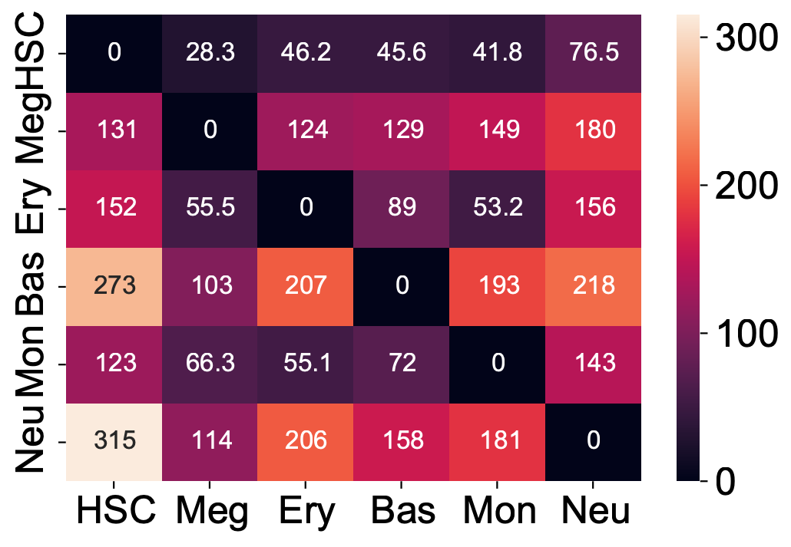

Kinetics heatmap of gene expression dynamics along the LAP
-----------------------------------------------------------

As mentioned above, we are able to obtain the gene-wise kinetics when we reverse projected the LAP learned in PCA space back to gene-wise space. In this section we will show how to do so and we will create a kinetics heatmap of the transcriptomic dynamics along the LAP from HSC to basophil lineage. We will rely on mainly two functions, ``dyn.pd.least_action``  and ``dyn.pl.kinetic_heatmap``. ``dyn.pd.least_action`` can be used to computes the optimal paths between any two cell states, as mentioned above while ``dyn.pl.kinetic_heatmap`` can be used to plot kinetics
heatmap.

Here we will identify the LAP from the HSC to basophil lineage, and thus one typical HSC and one typical basophil cell are chosen as the initial and target cell, respectively. 

.. code:: ipython3

    init_cells = [adata_labeling.obs_names[HSC_cells_indices[0][0]]]
    target_cells = [adata_labeling.obs_names[Bas_cells_indices[0][0]]]
    print("init cells:", init_cells)
    print("end cells:", target_cells)

.. parsed-literal::

    init cells: ['GGGGGGCGGCCT-JL_10']
    end cells: ['GCAGCGAAGGCA-JL12_0']

Now let us find the optimal path between HSC to basophil lineage via the ``least_action`` function.

.. code:: ipython3

    dyn.configuration.set_pub_style(scaler=0.6)
    
    lap = dyn.pd.least_action(
        adata_labeling,
        init_cells=init_cells,
        target_cells=target_cells,
        basis="pca",
        adj_key="cosine_transition_matrix",
    )

.. parsed-literal::

    |-----> [iterating through 1 pairs] in progress: 100.0000%
    |-----> [iterating through 1 pairs] finished [9.2680s]

Now let us plot the kinetic heatmap of the gene expression kinetics of all transcription factors (restricted only to those that are used for calculating the velocity transition matrix) along the LAP from HSC to basophil lineage.  

.. code:: ipython3

    
    is_human_tfs = [gene in human_tfs_names for gene in adata_labeling.var_names[adata_labeling.var.use_for_transition]]
    human_genes = adata_labeling.var_names[adata_labeling.var.use_for_transition][is_human_tfs]
    dyn.configuration.set_pub_style(scaler=0.6)
    sns.set(font_scale=0.8)
    sns_heatmap = dyn.pl.kinetic_heatmap(
        adata_labeling,
        basis="pca",
        mode="lap",
        figsize=(10, 5),
        genes=human_genes,
        project_back_to_high_dim=True,
        save_show_or_return="return",
        color_map="bwr",
        transpose=True,
        xticklabels=True,
        yticklabels=False
    )
    
    plt.setp(sns_heatmap.ax_heatmap.yaxis.get_majorticklabels(), rotation=0)
    plt.tight_layout()

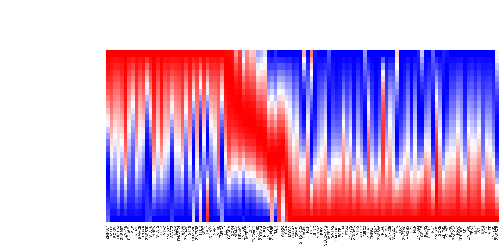

Now let us swap ``target_cells`` and ``init_cells``, when passing parameters into ``dyn.pd.least_action``, to draw the  the kinetic heatmap of the gene expression kinetics of all transcription factors along the LAP from basophil to HSC. 

.. code:: ipython3

    from matplotlib import pyplot, transforms

    is_human_tfs = [gene in human_tfs_names for gene in adata_labeling.var_names[adata_labeling.var.use_for_transition]]
    human_genes = adata_labeling.var_names[adata_labeling.var.use_for_transition][is_human_tfs]
    lap = dyn.pd.least_action(
        adata_labeling,
        init_cells=target_cells,
        target_cells=init_cells,
        basis="pca",
        adj_key="cosine_transition_matrix",
    )
    sns.set(font_scale=0.8)
    sns_heatmap = dyn.pl.kinetic_heatmap(
        adata_labeling,
        basis="pca",
        mode="lap",
        figsize=(16, 8),
        genes=human_genes,
        project_back_to_high_dim=True,
        save_show_or_return="return",
        color_map="bwr",
        transpose=True,
        xticklabels=True,
        yticklabels=False,
    )
    plt.setp(sns_heatmap.ax_heatmap.xaxis.get_majorticklabels(), rotation=90)
    plt.tight_layout()

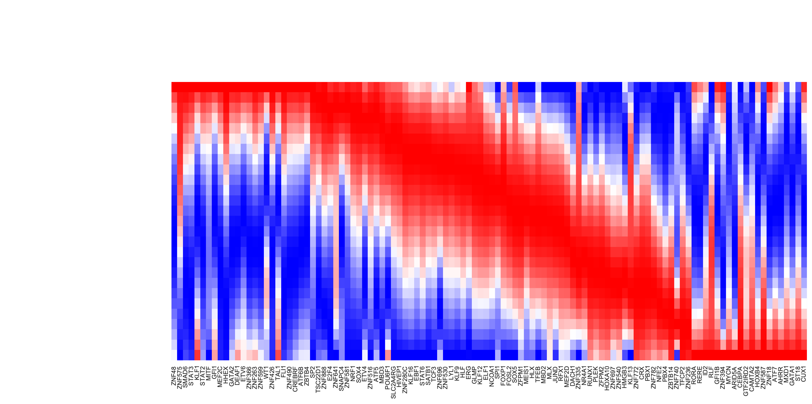

Evaluate TF rankings based on LAP analyses
~~~~~~~~~~~~~~~~~~~~~~~~~~~~~~~~~~~~~~~~~~~~~~~~~~~~~~~~~~~~~~~
As mentioned above, we can rank TFs based on the mean square displacement (MSD) along the LAP . In this section, we are going to evaluate rankings from LAP analyses by comparing with known transcription factors that enable the successful cell fate conversion, reported from literature. More details can be found in the dynamo paper :cite:p:`QIU2022`. 

We first prepare TF ranking dataframes that will be used to create ranking statistics in this
section. We first identify the TFs from all genes (``["TF"]`` key) and tag TFs that are known transcription factor for the corresponding cell fate conversion  (``["known_TF"]`` key). To the best we can, we all manually compiled all known factors for all known hematopoietic cell fate transitions (including developmental process). Please see supplementary table 2 from dynamo paper :cite:p:`QIU2022` for more details. 

This part is specific to our scNT-seq dataset but should be easily changed to meet your needs as well. 

.. code:: ipython3

    %%capture
    HSC_Meg_ranking = transition_graph["HSC->Meg"]["ranking"]
    HSC_Meg_ranking["TF"] = [i in human_tfs_names for i in list(HSC_Meg_ranking["all"])]
    
    HSC_Meg_ranking = HSC_Meg_ranking.query("TF == True")
    HSC_Meg_ranking["known_TF"] = [
        i in ["GATA1", "GATA2", "ZFPM1", "GFI1B", "FLI1", "NFE2"] for i in list(HSC_Meg_ranking["all"])
    ]
    
    HSC_Ery_ranking = transition_graph["HSC->Ery"]["ranking"]
    HSC_Ery_ranking["TF"] = [i in human_tfs_names for i in list(HSC_Ery_ranking["all"])]
    
    HSC_Ery_ranking = HSC_Ery_ranking.query("TF == True")
    HSC_Ery_ranking["known_TF"] = [
        i in ["GATA1", "ZFPM1", "GFI1B", "KLF1", "SPI1", "GATA2", "LDB1", "TAL1", "ZFPM1"]
        for i in list(HSC_Ery_ranking["all"])
    ]
    
    HSC_Bas_ranking = transition_graph["HSC->Bas"]["ranking"]
    HSC_Bas_ranking["TF"] = [i in human_tfs_names for i in list(ranking["all"])]
    
    HSC_Bas_ranking = HSC_Bas_ranking.query("TF == True")
    HSC_Bas_ranking["known_TF"] = [i in ["CEBPA", "GATA2", "GATA1", "RUNX1"] for i in list(HSC_Bas_ranking["all"])]
    HSC_Bas_ranking
    
    HSC_Mon_ranking = transition_graph["HSC->Mon"]["ranking"]
    HSC_Mon_ranking["TF"] = [i in human_tfs_names for i in list(ranking["all"])]
    
    HSC_Mon_ranking = HSC_Mon_ranking.query("TF == True")
    HSC_Mon_ranking["known_TF"] = [i in ["SPI1", "IRF8", "IRF5", "ZEB2", "KLF4"] for i in list(HSC_Mon_ranking["all"])]
    HSC_Mon_ranking
    
    HSC_Neu_ranking = transition_graph["HSC->Neu"]["ranking"]
    HSC_Neu_ranking["TF"] = [i in human_tfs_names for i in list(HSC_Neu_ranking["all"])]
    
    HSC_Neu_ranking = HSC_Neu_ranking.query("TF == True")
    HSC_Neu_ranking["known_TF"] = [i in ["GFI1", "PER3", "GATA1", "ETS3"] for i in list(HSC_Neu_ranking["all"])]
    HSC_Neu_ranking
    
    #
    Meg_HSC_ranking = transition_graph["Meg->HSC"]["ranking"]
    Meg_HSC_ranking["TF"] = [i in human_tfs_names for i in list(Meg_HSC_ranking["all"])]
    
    Meg_HSC_ranking = Meg_HSC_ranking.query("TF == True")
    Meg_HSC_ranking["known_TF"] = [
        i in ["RUN1T1", "HLF", "LMO2", "PRDM5", "PBX1", "ZFP37", "MYCN", "MEIS1"] for i in list(Meg_HSC_ranking["all"])
    ]
    
    
    Ery_Mon_ranking = transition_graph["Ery->Mon"]["ranking"]
    Ery_Mon_ranking["TF"] = [i in human_tfs_names for i in list(Ery_Mon_ranking["all"])]
    
    Ery_Mon_ranking = Ery_Mon_ranking.query("TF == True")
    Ery_Mon_ranking["known_TF"] = [i in ["LSD1", "RUNX1"] for i in list(Ery_Mon_ranking["all"])]
    
    Ery_Neu_ranking = transition_graph["Ery->Neu"]["ranking"]
    Ery_Neu_ranking["TF"] = [i in human_tfs_names for i in list(Ery_Neu_ranking["all"])]
    
    Ery_Neu_ranking = Ery_Neu_ranking.query("TF == True")
    Ery_Neu_ranking["known_TF"] = [i in ["LSD1", "RUNX1"] for i in list(Ery_Neu_ranking["all"])]
    
    # http://genesdev.cshlp.org/content/20/21/3010.long
    
    Mon_Bas_ranking = transition_graph["Mon->Bas"]["ranking"]
    Mon_Bas_ranking["TF"] = [i in human_tfs_names for i in list(Mon_Bas_ranking["all"])]
    
    Mon_Bas_ranking = Mon_Bas_ranking.query("TF == True")
    Mon_Bas_ranking["known_TF"] = [i in ["GATA2", "CEBPA"] for i in list(Mon_Bas_ranking["all"])]
    
    Neu_Bas_ranking = transition_graph["Neu->Bas"]["ranking"]
    Neu_Bas_ranking["TF"] = [i in human_tfs_names for i in list(Neu_Bas_ranking["all"])]
    
    Neu_Bas_ranking = Neu_Bas_ranking.query("TF == True")
    Neu_Bas_ranking["known_TF"] = [i in ["GATA2", "CEBPA"] for i in list(Mon_Bas_ranking["all"])]
    
    
    # GATA-1 Converts Lymphoid and Myelomonocytic Progenitors into the Megakaryocyte/Erythrocyte Lineages
    
    Mon_Meg_ranking = transition_graph["Mon->Meg"]["ranking"]
    Mon_Meg_ranking["TF"] = [i in human_tfs_names for i in list(Mon_Meg_ranking["all"])]
    
    Mon_Meg_ranking = Mon_Meg_ranking.query("TF == True")
    Mon_Meg_ranking["known_TF"] = [i in ["GATA1", "ZFPM1", "GATA2"] for i in list(Mon_Meg_ranking["all"])]
    
    Mon_Ery_ranking = transition_graph["Mon->Ery"]["ranking"]
    Mon_Ery_ranking["TF"] = [i in human_tfs_names for i in list(Mon_Ery_ranking["all"])]
    
    Mon_Ery_ranking = Mon_Ery_ranking.query("TF == True")
    Mon_Ery_ranking["known_TF"] = [i in ["GATA1", "ZFPM1", "GATA2"] for i in list(Mon_Ery_ranking["all"])]
    
    
    # Tom's paper
    Meg_Neu_ranking = transition_graph["Meg->Neu"]["ranking"]
    Meg_Neu_ranking["TF"] = [i in human_tfs_names for i in list(Meg_Neu_ranking["all"])]
    
    Meg_Neu_ranking = Meg_Neu_ranking.query("TF == True")
    Meg_Neu_ranking["known_TF"] = [i in ["CEBPA", "CEBPB", "CEBPE", "SPI1"] for i in list(Meg_Neu_ranking["all"])]
    
    Ery_Neu_ranking = transition_graph["Ery->Neu"]["ranking"]
    Ery_Neu_ranking["TF"] = [i in human_tfs_names for i in list(Ery_Neu_ranking["all"])]
    
    Ery_Neu_ranking = Ery_Neu_ranking.query("TF == True")
    Ery_Neu_ranking["known_TF"] = [i in ["CEBPA", "CEBPB", "CEBPE", "SPI1"] for i in list(Ery_Neu_ranking["all"])]

.. code:: ipython3

    lap_dict = transition_graph[cell_type[0] + "->" + cell_type[3]]["LAP_pca"]
    lap_dict["t"] *= 3
    adata_labeling.uns["LAP_pca"] = lap_dict

Ranking TF's importance for each LAP
------------------------------------

Let's re-rank each known TF from each known hematopoietic fate conversion based on their MSD rankings among all TFs. We will use the helper function
``assign_tf_ranks`` to achieve this purpose. All the known TFs are collected from literature as mentioned above.

.. code:: ipython3

    def assign_tf_ranks(transition_graph: dict, transition: str, tfs: list, tfs_key="TFs", tfs_rank_key="TFs_rank"):
        ranking = transition_graph[transition]["ranking"]
        ranking["TF"] = [i in human_tfs_names for i in list(ranking["all"])]
        true_tf_list = list(ranking.query("TF == True")["all"])
        all_tfs = list(ranking.query("TF == True")["all"])
        transition_graph[transition][tfs_key] = tfs
    
        transition_graph[transition][tfs_rank_key] = [
            all_tfs.index(key) if key in true_tf_list else -1 for key in transition_graph[transition][tfs_key]
        ]
    
    
    assign_tf_ranks(transition_graph, "HSC->Meg", ["GATA1", "GATA2", "ZFPM1", "GFI1B", "FLI1", "NFE2"])

.. code:: ipython3

    transition_graph["HSC->Meg"]["TFs"]

.. parsed-literal::

    ['GATA1', 'GATA2', 'ZFPM1', 'GFI1B', 'FLI1', 'NFE2']

.. code:: ipython3

    assign_tf_ranks(
        transition_graph, "HSC->Ery", ["GATA1", "ZFPM1", "GFI1B", "KLF1", "SPI1", "GATA2", "LDB1", "TAL1", "ZFPM1"]
    )

.. code:: ipython3

    assign_tf_ranks(transition_graph, "HSC->Bas", ["STAT5", "GATA2", "CEBPA", "MITF"])
    assign_tf_ranks(transition_graph, "HSC->Bas", ["CEBPA", "GATA2", "GATA1", "RUNX1"])

.. code:: ipython3

    assign_tf_ranks(transition_graph, "HSC->Mon", ["SPI1", "IRF8", "IRF5", "ZEB2", "KLF4"])

.. code:: ipython3

    assign_tf_ranks(transition_graph, "HSC->Neu", ["GFI1", "PER3", "GATA1", "ETS3"])

.. code:: ipython3

    assign_tf_ranks(transition_graph, "Meg->HSC", ["RUN1T1", "HLF", "LMO2", "PRDM5", "PBX1", "ZFP37", "MYCN", "MEIS1"])

.. code:: ipython3

    assign_tf_ranks(transition_graph, "Mon->Meg", ["GATA1", "ZFPM1", "GATA2"])

.. code:: ipython3

    assign_tf_ranks(transition_graph, "Mon->Ery", ["GATA1", "ZFPM1", "GATA2"])

.. code:: ipython3

    assign_tf_ranks(transition_graph, "Meg->Neu", ["CEBPA", "CEBPB", "CEBPE", "SPI1"])

.. code:: ipython3

    # Tom's paper
    assign_tf_ranks(
        transition_graph, "Ery->Neu", ["CEBPA", "CEBPB", "CEBPE", "SPI1"], tfs_rank_key="TFs_rank2", tfs_key="TFs2"
    )

An erythroid to myeloid cell fate conversion is elicited by LSD1
inactivation

.. code:: ipython3

    assign_tf_ranks(transition_graph, "Ery->Mon", ["LSD1", "RUNX1"])
    assign_tf_ranks(transition_graph, "Ery->Neu", ["LSD1", "RUNX1"], tfs_rank_key="TFs_rank1", tfs_key="TFs1")

.. code:: ipython3

    # http://genesdev.cshlp.org/content/20/21/3010.long
    assign_tf_ranks(transition_graph, "Mon->Bas", ["GATA2", "CEBPA"])
    
    assign_tf_ranks(transition_graph, "Neu->Bas", ["GATA2", "CEBPA"])

.. code:: ipython3

    transition_graph["Ery->Neu"]["TFs2"], transition_graph["Ery->Neu"]["TFs_rank2"]

.. parsed-literal::

    (['CEBPA', 'CEBPB', 'CEBPE', 'SPI1'], [0, -1, -1, 17])

Here we will convert the rankings of known TFs to a priority score, simply defined as :math:`1 - \frac{\# rank}{\# TF}`.

.. code:: ipython3

    from functools import reduce
    
    reprogramming_mat_dict = {
        "HSC->Meg": {
            "genes": transition_graph["HSC->Meg"]["TFs"],
            "rank": transition_graph["HSC->Meg"]["TFs_rank"],
            "PMID": 18295580,
        },
        "HSC->Ery": {
            "genes": transition_graph["HSC->Ery"]["TFs"],
            "rank": transition_graph["HSC->Ery"]["TFs_rank"],
            "PMID": 18295580,
        },
        "HSC->Bas": {
            "genes": transition_graph["HSC->Ery"]["TFs"],
            "rank": transition_graph["HSC->Ery"]["TFs_rank"],
            "PMID": 18295580,
        },
        "HSC->Mon": {
            "genes": transition_graph["HSC->Mon"]["TFs"],
            "rank": transition_graph["HSC->Mon"]["TFs_rank"],
            "PMID": 18295580,
        },
        "HSC->Neu": {
            "genes": transition_graph["HSC->Neu"]["TFs"],
            "rank": transition_graph["HSC->Neu"]["TFs_rank"],
            "PMID": 18295580,
        },
        "Meg->HSC": {
            "genes": transition_graph["Meg->HSC"]["TFs"],
            "rank": transition_graph["Meg->HSC"]["TFs_rank"],
            "PMID": 24766805,
        },
        "Meg->Neu": {
            "genes": transition_graph["Meg->Neu"]["TFs"],
            "rank": transition_graph["Meg->Neu"]["TFs_rank"],
            "PMID": 31395745,
        },
        "Ery->Mon": {
            "genes": transition_graph["Ery->Mon"]["TFs"],
            "rank": transition_graph["Ery->Mon"]["TFs_rank"],
            "PMID": 34324630,
        },
        "Ery->Neu1": {
            "genes": transition_graph["Ery->Neu"]["TFs1"],
            "rank": transition_graph["Ery->Neu"]["TFs_rank1"],
            "PMID": 31395745,
        },
        "Ery->Neu2": {
            "genes": transition_graph["Ery->Neu"]["TFs2"],
            "rank": transition_graph["Ery->Neu"]["TFs_rank2"],
            "PMID": 34324630,
        },
        "Mon->Meg": {
            "genes": transition_graph["Mon->Meg"]["TFs"],
            "rank": transition_graph["Mon->Meg"]["TFs_rank"],
            "PMID": 14499119,
        },
        "Mon->Ery": {
            "genes": transition_graph["Mon->Ery"]["TFs"],
            "rank": transition_graph["Mon->Ery"]["TFs_rank"],
            "PMID": 14499119,
        },
        "Mon->Bas": {
            "genes": transition_graph["Mon->Bas"]["TFs"],
            "rank": transition_graph["Mon->Bas"]["TFs_rank"],
            "PMID": 17079688,
        },
        "Neu->Bas": {
            "genes": transition_graph["Neu->Bas"]["TFs"],
            "rank": transition_graph["Neu->Bas"]["TFs_rank"],
            "PMID": 17079688,
        },
    }
    
    
    reprogramming_mat_df = pd.DataFrame(reprogramming_mat_dict)
    
    for key in reprogramming_mat_df:
        assert len(reprogramming_mat_df[key]["genes"]) == len(reprogramming_mat_df[key]["rank"]), str(key)
    
    
    all_genes = reduce(lambda a, b: a + b, reprogramming_mat_df.loc["genes", :])
    all_rank = reduce(lambda a, b: a + b, reprogramming_mat_df.loc["rank", :])
    all_keys = np.repeat(
        np.array(list(reprogramming_mat_dict.keys())), [len(i) for i in reprogramming_mat_df.loc["genes", :]]
    )
    
    reprogramming_mat_df_p = pd.DataFrame({"genes": all_genes, "rank": all_rank, "transition": all_keys})
    reprogramming_mat_df_p = reprogramming_mat_df_p.query("rank > -1")
    reprogramming_mat_df_p["type"] = reprogramming_mat_df_p["transition"].map(
        {
            "HSC->Meg": "development",
            "HSC->Ery": "development",
            "HSC->Bas": "development",
            "HSC->Mon": "development",
            "HSC->Neu": "development",
            "Meg->HSC": "reprogramming",
            "Meg->Neu": "transdifferentiation",
            "Ery->Mon": "transdifferentiation",
            "Ery->Neu1": "transdifferentiation",
            "Ery->Neu2": "transdifferentiation",
            "Mon->Meg": "transdifferentiation",
            "Mon->Ery": "transdifferentiation",
            "Mon->Bas": "transdifferentiation",
            "Neu->Bas": "transdifferentiation",
        }
    )
    
    reprogramming_mat_df_p["rank"] /= 133
    reprogramming_mat_df_p["rank"] = 1 - reprogramming_mat_df_p["rank"]

Plotting priority scores of known TFs for specific hematopoietic trandifferentiations
-------------------------------------------------------------------------------------

The y-axis is the hematopoietic trandifferentiation and the x-axis the TF priority scores for a specific transition.

.. code:: ipython3

    dyn.configuration.set_pub_style()
    transition_color_dict = {"development": "#2E3192", "reprogramming": "#EC2227", "transdifferentiation": "#B9519E"}
    
    reprogramming_mat_df_p_subset = reprogramming_mat_df_p.query("type == 'transdifferentiation'")
    rank = reprogramming_mat_df_p_subset["rank"].values
    transition = reprogramming_mat_df_p_subset["transition"].values
    genes = reprogramming_mat_df_p_subset["genes"].values
    
    fig, ax = plt.subplots(1, 1, figsize=(6, 4))
    sns.scatterplot(
        y="transition",
        x="rank",
        data=reprogramming_mat_df_p_subset,
        ec=None,
        hue="type",
        alpha=0.8,
        ax=ax,
        s=50,
        palette=transition_color_dict,
        clip_on=False,
    )
    
    for i in range(reprogramming_mat_df_p_subset.shape[0]):
        annote_text = genes[i]  # STK_ID
        ax.annotate(
            annote_text, xy=(rank[i], transition[i]), xytext=(0, 3), textcoords="offset points", ha="center", va="bottom"
        )
    
    plt.axvline(0.8, linestyle="--", lw=0.5)
    ax.set_xlim(0.6, 1.01)
    ax.set_xlabel("")
    ax.set_xlabel("Score")
    ax.set_yticklabels(list(reprogramming_mat_dict.keys())[6:], rotation=0)
    ax.legend().set_visible(False)
    ax.spines.top.set_position(("outward", 10))
    ax.spines.bottom.set_position(("outward", 10))
    
    ax.spines.right.set_visible(False)
    ax.spines.top.set_visible(False)
    ax.yaxis.set_ticks_position("left")
    ax.xaxis.set_ticks_position("bottom")
    plt.show()

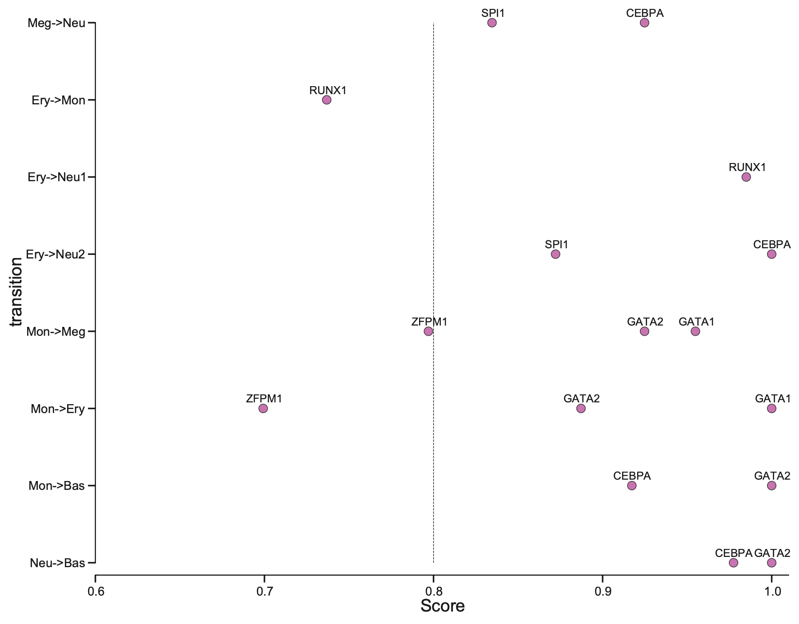

From the above plot, you can appreciate that our prediction works very well. Majority of the known TFs of the known transitions are prioritized as > 0.8 while some of them achiving perfect prioritization (score ~= 1).

ROC curve analyses of TF priorization of the LAP predictions
------------------------------------------------------------

Last but not least, let us evaluate our TF ranking via receiver operating curve (ROC) analyses. ROC of LAP TF prioritization predictions when using all known genes of all known transitions as the gold standard (see STAR Methods of :cite:p:`QIU2022`) reveals an AUC (area under curve) of ``0.83``, again indicating our LAP predictions and TFs prioritization works quiet well. 

These analyses reveal the potential of the LAP approach to predict the optimal paths and TF cocktails of cell-fate transitions with high accuracy, paving the road for à la carte reprogramming between any cell types of interest for applications in regenerative medicine (Graf and Enver, 2009).

.. code:: ipython3

    all_ranks_list = [
        HSC_Meg_ranking,
        HSC_Ery_ranking,
        HSC_Bas_ranking,
        HSC_Mon_ranking,
        HSC_Neu_ranking,
        Meg_HSC_ranking,
        Ery_Mon_ranking,
        Ery_Neu_ranking,
        Mon_Bas_ranking,
        Neu_Bas_ranking,
        Mon_Meg_ranking,
        Mon_Ery_ranking,
        Meg_Neu_ranking,
        Ery_Neu_ranking,
    ]
    
    all_ranks_df = pd.concat(all_ranks_list)
    
    all_ranks_df["priority_score"] = (
        1 - np.tile(np.arange(HSC_Bas_ranking.shape[0]), len(all_ranks_list)) / HSC_Bas_ranking.shape[0]
    )
    # all_ranks_df['priority_score'].hist()
    TFs = ranking["all"][ranking["TF"]].values
    valid_TFs = np.unique(reprogramming_mat_df_p["genes"].values)

.. code:: ipython3

    from sklearn.metrics import roc_curve, auc
    
    use_abs = False
    top_genes = len(TFs)
    
    cls = all_ranks_df["known_TF"].astype(int)
    pred = all_ranks_df["priority_score"]
    
    fpr, tpr, _ = roc_curve(cls, pred)
    roc_auc = auc(fpr, tpr)
    
    
    dyn.configuration.set_pub_style_mpltex()
    plt.figure(figsize=(1.3, 1))
    
    lw = 0.5
    plt.figure(figsize=(5, 5))
    plt.plot(fpr, tpr, color="darkorange", lw=lw, label="ROC curve (area = %0.2f)" % roc_auc)
    plt.plot([0, 1], [0, 1], color="navy", lw=lw, linestyle="--")
    plt.xlim([0.0, 1.0])
    plt.ylim([0.0, 1.05])
    plt.xlabel("False Positive Rate")
    plt.ylabel("True Positive Rate")
    # plt.title(cur_guide)
    plt.legend(loc="lower right")
    plt.show()
    
    plt.tight_layout()

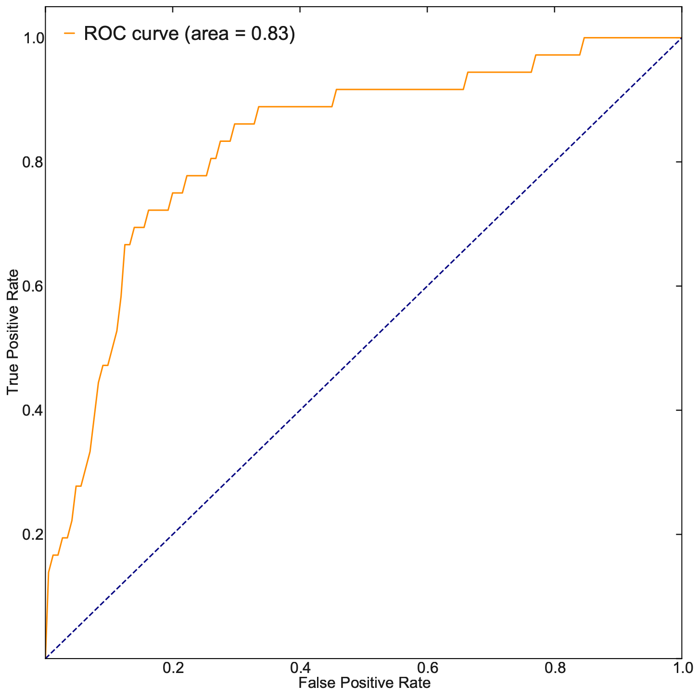

