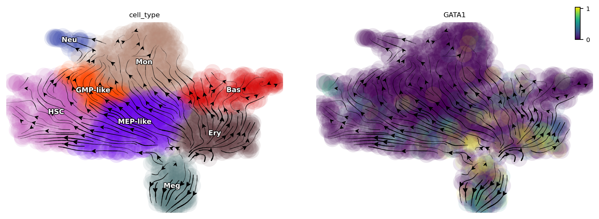
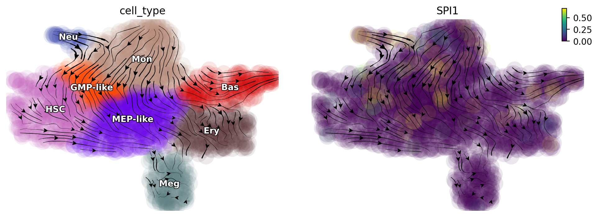
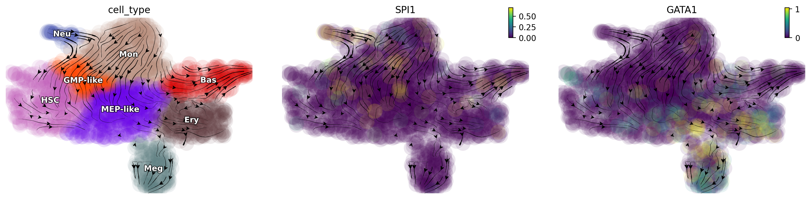
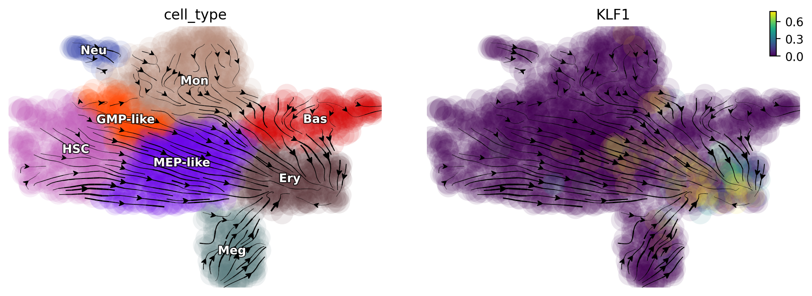
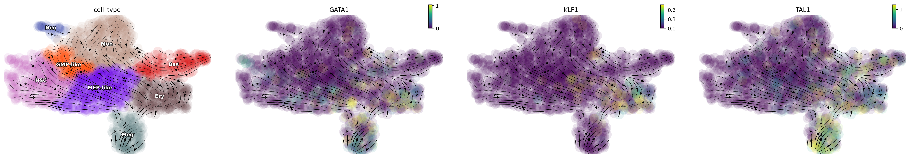

.. raw:: html

    

      
      
    

*in silico* perturbation
=================

In the dynamo Cell paper :cite:p:`QIU2022`, we introduced the analytical form of a
vector field. This permits *in silico* perturbation predictions of expression
for each gene in each cell and the cell fate diversions after
genetic perturbations. In particular, we demonstrated the predictive
power of hematopoietic fate trajectory predictions after genetic
perturbations. 

| In this tutorial, we will cover the following topics:
- Perturbation functionality and API in dynamo 
- How to single or combinatorial perturbation (either repression or activation) in hematopoietic scNT-seq dataset 
- Visualize gene perturbation effects 
- Reproduce results in dynamo paper Fig.7 :cite:p:`QIU2022` 

| - :ref:`You can read more about theory part here<perturbation_theory_tutorial>`.
Perturbation method introduction
~~~~~~~~~~~~~~~~~~~~~~~~~~~~~~~~

Import relevant packages

.. code:: ipython3

    import numpy as np
    import pandas as pd
    import matplotlib.pyplot as plt
    
    import sys
    import os
    
    import dynamo as dyn
    dyn.dynamo_logger.main_silence()

.. parsed-literal::

    |-----> setting visualization default mode in dynamo. Your customized matplotlib settings might be overritten.

.. code:: ipython3

    adata_labeling = dyn.sample_data.hematopoiesis()

Let us take a glance at what is in ``adata`` object. Preprocessing, normalization, umap dimension reduction, total RNA velocity, as well as the continous RNA velocity vector field are computed (notebooks on these operations will be released shortly. Please also check other existing notebooks for these operations). 

.. code:: ipython3

    adata_labeling

.. parsed-literal::

    AnnData object with n_obs × n_vars = 1947 × 1956
        obs: 'batch', 'time', 'cell_type', 'nGenes', 'nCounts', 'pMito', 'pass_basic_filter', 'new_Size_Factor', 'initial_new_cell_size', 'total_Size_Factor', 'initial_total_cell_size', 'spliced_Size_Factor', 'initial_spliced_cell_size', 'unspliced_Size_Factor', 'initial_unspliced_cell_size', 'Size_Factor', 'initial_cell_size', 'ntr', 'cell_cycle_phase', 'leiden', 'umap_leiden', 'umap_louvain', 'control_point_pca', 'inlier_prob_pca', 'obs_vf_angle_pca', 'pca_ddhodge_div', 'pca_ddhodge_potential', 'umap_ori_ddhodge_div', 'umap_ori_ddhodge_potential', 'curl_umap_ori', 'divergence_umap_ori', 'control_point_umap_ori', 'inlier_prob_umap_ori', 'obs_vf_angle_umap_ori', 'acceleration_pca', 'curvature_pca', 'n_counts', 'mt_frac', 'jacobian_det_pca', 'manual_selection', 'divergence_pca', 'curvature_umap_ori', 'acceleration_umap_ori', 'control_point_umap', 'inlier_prob_umap', 'obs_vf_angle_umap', 'curvature_umap', 'curv_leiden', 'curv_louvain', 'SPI1->GATA1_jacobian', 'jacobian'
        var: 'gene_name', 'gene_id', 'nCells', 'nCounts', 'pass_basic_filter', 'use_for_pca', 'frac', 'ntr', 'time_3_alpha', 'time_3_beta', 'time_3_gamma', 'time_3_half_life', 'time_3_alpha_b', 'time_3_alpha_r2', 'time_3_gamma_b', 'time_3_gamma_r2', 'time_3_gamma_logLL', 'time_3_delta_b', 'time_3_delta_r2', 'time_3_bs', 'time_3_bf', 'time_3_uu0', 'time_3_ul0', 'time_3_su0', 'time_3_sl0', 'time_3_U0', 'time_3_S0', 'time_3_total0', 'time_3_beta_k', 'time_3_gamma_k', 'time_5_alpha', 'time_5_beta', 'time_5_gamma', 'time_5_half_life', 'time_5_alpha_b', 'time_5_alpha_r2', 'time_5_gamma_b', 'time_5_gamma_r2', 'time_5_gamma_logLL', 'time_5_bs', 'time_5_bf', 'time_5_uu0', 'time_5_ul0', 'time_5_su0', 'time_5_sl0', 'time_5_U0', 'time_5_S0', 'time_5_total0', 'time_5_beta_k', 'time_5_gamma_k', 'use_for_dynamics', 'gamma', 'gamma_r2', 'use_for_transition', 'gamma_k', 'gamma_b'
        uns: 'PCs', 'VecFld_pca', 'VecFld_umap', 'VecFld_umap_ori', 'X_umap_ori_neighbors', 'cell_phase_genes', 'cell_type_colors', 'dynamics', 'explained_variance_ratio_', 'feature_selection', 'grid_velocity_pca', 'grid_velocity_umap', 'grid_velocity_umap_ori', 'grid_velocity_umap_ori_perturbation', 'grid_velocity_umap_ori_test', 'grid_velocity_umap_perturbation', 'jacobian_pca', 'leiden', 'neighbors', 'pca_mean', 'pp', 'response'
        obsm: 'X', 'X_pca', 'X_pca_SparseVFC', 'X_umap', 'X_umap_SparseVFC', 'X_umap_ori', 'X_umap_ori_SparseVFC', 'X_umap_ori_perturbation', 'X_umap_ori_test', 'X_umap_perturbation', 'acceleration_pca', 'acceleration_umap_ori', 'cell_cycle_scores', 'curvature_pca', 'curvature_umap', 'curvature_umap_ori', 'j_delta_x_perturbation', 'velocity_pca', 'velocity_pca_SparseVFC', 'velocity_umap', 'velocity_umap_SparseVFC', 'velocity_umap_ori', 'velocity_umap_ori_SparseVFC', 'velocity_umap_ori_perturbation', 'velocity_umap_ori_test', 'velocity_umap_perturbation'
        layers: 'M_n', 'M_nn', 'M_t', 'M_tn', 'M_tt', 'X_new', 'X_total', 'velocity_alpha_minus_gamma_s'
        obsp: 'X_umap_ori_connectivities', 'X_umap_ori_distances', 'connectivities', 'cosine_transition_matrix', 'distances', 'fp_transition_rate', 'moments_con', 'pca_ddhodge', 'perturbation_transition_matrix', 'umap_ori_ddhodge'

*In silico* perturbation with ``dyn.pd.perturbation``
----------------------------------------------------

The ``dyn.pd.perturbation``  function from *dynamo* can be used to either upregulating or suppressing a single or multiple genes in a particular cell or across all cells to perform *in silico* genetic perturbation. 
When integrating the perturbation vectors across cells we can then also predict cell-fate outcomes after the perturbation which can be visualized as the perturbation streamlines. 

In the following, we will first delve into the *in silico* perturbations of the canonical PU.1/SPI1-GATA1 network motif that specifies the GMP or MEP lineage during hematopoiesis, respectively. 

Mutual exclusive effects after perturbing either GATA1 or SPI1 gene
~~~~~~~~~~~~~~~~~~~~~~~~~~~~~~~~~~~~~~~~~~~~~~~~~~~~~~~~~~~~~~~~~~~

As we all know, GATA1 is the master regulator of the GMP lineage while SPI1 is the master regulator for the MEP lineage and GATA1 and PU1 forms a mutual inhibition and self-activation network motif. 

We first suppress the expression of GATA1 and it can divert cells from GMP-related lineages to MEP-related lineages.

.. code:: ipython3

    gene = "GATA1"
    dyn.pd.perturbation(adata_labeling, gene, [-100], emb_basis="umap")
    dyn.pl.streamline_plot(adata_labeling, color=["cell_type", gene], basis="umap_perturbation")

.. parsed-literal::

    |-----> [projecting velocity vector to low dimensional embedding] in progress: 100.0000%
    |-----> [projecting velocity vector to low dimensional embedding] finished [0.3502s]

When suppressing the expression of SPI1, we find that cells from MEP-related lineages are diverted to GMP-related lineages.

.. code:: ipython3

    gene = "SPI1"
    dyn.pd.perturbation(adata_labeling, gene, [-100], emb_basis="umap")
    dyn.pl.streamline_plot(adata_labeling, color=["cell_type", gene], basis="umap_perturbation")

.. parsed-literal::

    |-----> [projecting velocity vector to low dimensional embedding] in progress: 100.0000%
    |-----> [projecting velocity vector to low dimensional embedding] finished [0.3635s]

Double suppression of SPI1/GATA trap cell in the middle
~~~~~~~~~~~~~~~~~~~~~~~~~~~~~~~~~~~~~~~~~~~~~~~~~~~~~~~

Suppression of both SPI1 and GATA1 traps cells in the progenitor states.
These predictions align well with those reported in (Rekhtman et al., 1999) and reveal a seesaw-effect regulation between SPI1 and GATA1 in driving the GMP and the MEP lineages. 

.. code:: ipython3

    selected_genes =  [ "SPI1", "GATA1"]
    # expr_vals = [-100, -100]
    expr_vals = [-100, -15]
    dyn.pd.perturbation(adata_labeling, selected_genes, expr_vals, emb_basis="umap")
    dyn.pl.streamline_plot(adata_labeling, color=["cell_type", gene], basis="umap_perturbation")

.. parsed-literal::

    |-----> [projecting velocity vector to low dimensional embedding] in progress: 100.0000%
    |-----> [projecting velocity vector to low dimensional embedding] finished [0.4156s]

Activate KLF1
~~~~~~~~~~~~~

Dynamo *in silico* perturbation can correctly predicts other cellular transitions, showcased in :cite:p:`QIU2022`. Here we show that activation of KLF1 leads other cells convert into erythroid cells, consistent with :cite:p:`Orkin2008-vp`.

.. code:: ipython3

    gene = "KLF1"
    dyn.pd.perturbation(adata_labeling, gene, [100], emb_basis="umap")
    dyn.pl.streamline_plot(adata_labeling, color=["cell_type", gene], basis="umap_perturbation")

.. parsed-literal::

    |-----> [projecting velocity vector to low dimensional embedding] in progress: 100.0000%
    |-----> [projecting velocity vector to low dimensional embedding] finished [0.3362s]

Triple activation of "GATA1", "KLF1", "TAL1"
~~~~~~~~~~~~~~~~~~~~~~~~~~~~~~~~~~~~~~~~~~~~

Triple activation of GATA1, KLF1, and TAL1, known erythrocyte factors,
and TFs used for reprogramming fibroblasts into erythrocytes, diverts
most other cells into the Ery lineage :cite:p:`Capellera-Garcia2016-qp`.

.. code:: ipython3

    selected_genes =  ["GATA1", "KLF1", "TAL1"]
    expr_vals = [100, 100, 100]
    dyn.pd.perturbation(adata_labeling, selected_genes, expr_vals, emb_basis="umap")
    dyn.pl.streamline_plot(adata_labeling, color=["cell_type", gene], basis="umap_perturbation")

.. parsed-literal::

    |-----> [projecting velocity vector to low dimensional embedding] in progress: 100.0000%
    |-----> [projecting velocity vector to low dimensional embedding] finished [0.3842s]

