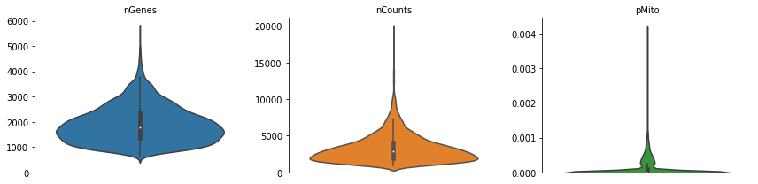
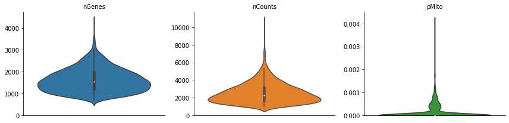
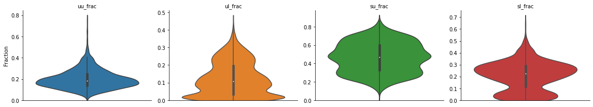
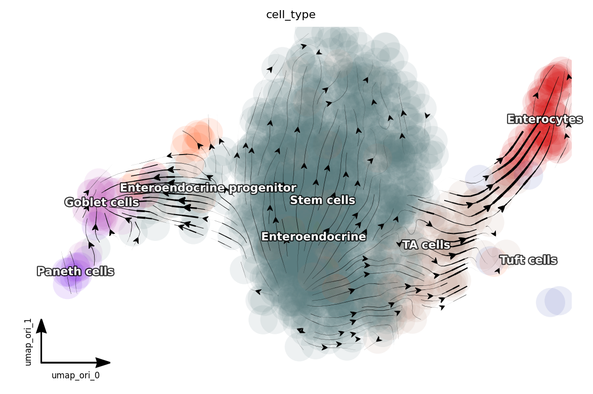
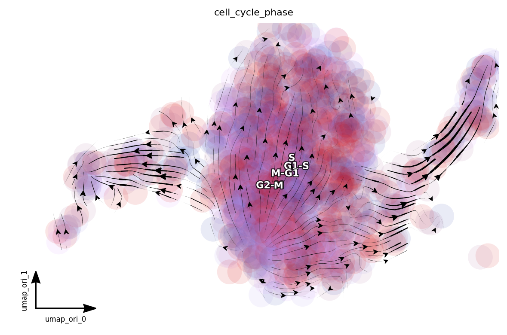
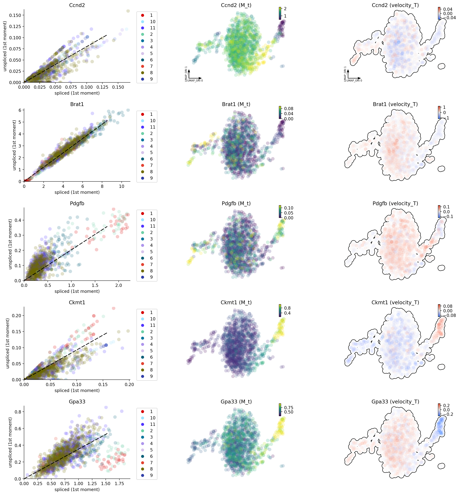

scEU-seq organoid
=================

This tutorial uses the intestine organoid data from Battich, et al
(2020). This tutorial is the second one of the two tutorials for
demonstrating how dynamo can use used to analyze the scEU-seq data.
Please refer the `cell
cycle <https://dynamo-release.readthedocs.io/en/latest/scEU_seq_rpe1_analysis_kinetic.html>`__
tutorial for details on how to analyze the cell cycle dataset.

.. code:: ipython3

    import warnings
    warnings.filterwarnings('ignore')
    
    import dynamo as dyn
    import anndata
    import pandas as pd
    import numpy as np
    import scipy.sparse
    
    from anndata import AnnData
    from scipy.sparse import csr_matrix
    
    dyn.get_all_dependencies_version()

.. raw:: html

    

    
    <table border="1" class="dataframe">
      <thead>
        <tr style="text-align: right;">
          <th>package</th>
          <th>dynamo-release</th>
          <th>umap-learn</th>
          <th>anndata</th>
          <th>cvxopt</th>
          <th>hdbscan</th>
          <th>loompy</th>
          <th>matplotlib</th>
          <th>numba</th>
          <th>numpy</th>
          <th>pandas</th>
          <th>pynndescent</th>
          <th>python-igraph</th>
          <th>scikit-learn</th>
          <th>scipy</th>
          <th>seaborn</th>
          <th>setuptools</th>
          <th>statsmodels</th>
          <th>tqdm</th>
          <th>trimap</th>
          <th>numdifftools</th>
          <th>colorcet</th>
        </tr>
      </thead>
      <tbody>
        <tr>
          <th>version</th>
          <td>0.95.2</td>
          <td>0.4.6</td>
          <td>0.7.4</td>
          <td>1.2.3</td>
          <td>0.8.26</td>
          <td>3.0.6</td>
          <td>3.3.0</td>
          <td>0.51.0</td>
          <td>1.19.1</td>
          <td>1.1.1</td>
          <td>0.4.8</td>
          <td>0.8.2</td>
          <td>0.23.2</td>
          <td>1.5.2</td>
          <td>0.9.0</td>
          <td>49.6.0</td>
          <td>0.11.1</td>
          <td>4.48.2</td>
          <td>1.0.12</td>
          <td>0.9.39</td>
          <td>2.0.2</td>
        </tr>
      </tbody>
    </table>
    

Load data
---------

.. code:: ipython3

    organoid = dyn.read('/Users/xqiu/Dropbox (Personal)/dynamo/dont_remove/organoid.h5ad')

.. code:: ipython3

    # mapping:
    cell_mapper = {
        '1': 'Enterocytes',
        '2': 'Enterocytes',
        '3': 'Enteroendocrine',
        '4': 'Enteroendocrine progenitor',
        '5': 'Tuft cells',
        '6': 'TA cells',
        '7': 'TA cells',
        '8': 'Stem cells',
        '9': 'Paneth cells',
        '10': 'Goblet cells',
        '11': 'Stem cells',
     }
    
    organoid.obs['cell_type'] = organoid.obs.som_cluster_id.map(cell_mapper).astype('str')

typical dynamo analysis workflow
--------------------------------

.. code:: ipython3

    dyn.pl.basic_stats(organoid)

.. code:: ipython3

    organoid

.. parsed-literal::

    AnnData object with n_obs × n_vars = 3831 × 9157
        obs: 'well_id', 'batch_id', 'treatment_id', 'log10_gfp', 'rotated_umap1', 'rotated_umap2', 'som_cluster_id', 'monocle_branch_id', 'monocle_pseudotime', 'exp_type', 'time', 'cell_type', 'nGenes', 'nCounts', 'pMito'
        var: 'ID', 'NAME'
        layers: 'sl', 'su', 'ul', 'uu'

.. code:: ipython3

    organoid.obs

.. raw:: html

    

    
    <table border="1" class="dataframe">
      <thead>
        <tr style="text-align: right;">
          <th></th>
          <th>well_id</th>
          <th>batch_id</th>
          <th>treatment_id</th>
          <th>log10_gfp</th>
          <th>rotated_umap1</th>
          <th>rotated_umap2</th>
          <th>som_cluster_id</th>
          <th>monocle_branch_id</th>
          <th>monocle_pseudotime</th>
          <th>exp_type</th>
          <th>time</th>
          <th>cell_type</th>
          <th>nGenes</th>
          <th>nCounts</th>
          <th>pMito</th>
        </tr>
      </thead>
      <tbody>
        <tr>
          <th>1</th>
          <td>14</td>
          <td>01</td>
          <td>Pulse_120</td>
          <td>12.8929281522</td>
          <td>23.0662174225</td>
          <td>-3.47039175034</td>
          <td>6</td>
          <td>2</td>
          <td>6.08688834859</td>
          <td>Pulse</td>
          <td>120</td>
          <td>TA cells</td>
          <td>1054</td>
          <td>1426.0</td>
          <td>0.0</td>
        </tr>
        <tr>
          <th>2</th>
          <td>15</td>
          <td>01</td>
          <td>Pulse_120</td>
          <td>5.85486775252</td>
          <td>25.710735321</td>
          <td>-1.31835341454</td>
          <td>2</td>
          <td>2</td>
          <td>9.14740876358</td>
          <td>Pulse</td>
          <td>120</td>
          <td>Enterocytes</td>
          <td>1900</td>
          <td>3712.0</td>
          <td>0.0</td>
        </tr>
        <tr>
          <th>3</th>
          <td>16</td>
          <td>01</td>
          <td>Pulse_120</td>
          <td>7.45690471634</td>
          <td>26.7709560394</td>
          <td>-1.06682777405</td>
          <td>2</td>
          <td>2</td>
          <td>9.69134627386</td>
          <td>Pulse</td>
          <td>120</td>
          <td>Enterocytes</td>
          <td>2547</td>
          <td>6969.0</td>
          <td>0.0</td>
        </tr>
        <tr>
          <th>4</th>
          <td>17</td>
          <td>01</td>
          <td>Pulse_120</td>
          <td>94.2814535609</td>
          <td>21.2927913666</td>
          <td>0.0159659013152</td>
          <td>11</td>
          <td>2</td>
          <td>4.2635104705</td>
          <td>Pulse</td>
          <td>120</td>
          <td>Stem cells</td>
          <td>1004</td>
          <td>1263.0</td>
          <td>0.0</td>
        </tr>
        <tr>
          <th>5</th>
          <td>21</td>
          <td>01</td>
          <td>Pulse_120</td>
          <td>47.1412266395</td>
          <td>19.9096126556</td>
          <td>0.884054124355</td>
          <td>11</td>
          <td>1</td>
          <td>2.62248093423</td>
          <td>Pulse</td>
          <td>120</td>
          <td>Stem cells</td>
          <td>927</td>
          <td>1144.0</td>
          <td>0.0</td>
        </tr>
        <tr>
          <th>...</th>
          <td>...</td>
          <td>...</td>
          <td>...</td>
          <td>...</td>
          <td>...</td>
          <td>...</td>
          <td>...</td>
          <td>...</td>
          <td>...</td>
          <td>...</td>
          <td>...</td>
          <td>...</td>
          <td>...</td>
          <td>...</td>
          <td>...</td>
        </tr>
        <tr>
          <th>3827</th>
          <td>378</td>
          <td>12</td>
          <td>Pulse_120</td>
          <td>32.496816667</td>
          <td>20.7663478851</td>
          <td>-3.72811675072</td>
          <td>8</td>
          <td>3</td>
          <td>7.32939908351</td>
          <td>Pulse</td>
          <td>120</td>
          <td>Stem cells</td>
          <td>2268</td>
          <td>3918.0</td>
          <td>0.0</td>
        </tr>
        <tr>
          <th>3828</th>
          <td>379</td>
          <td>12</td>
          <td>Pulse_120</td>
          <td>78.1198193763</td>
          <td>20.1073760986</td>
          <td>-2.65023303032</td>
          <td>8</td>
          <td>3</td>
          <td>5.10436147713</td>
          <td>Pulse</td>
          <td>120</td>
          <td>Stem cells</td>
          <td>2131</td>
          <td>3619.0</td>
          <td>0.0</td>
        </tr>
        <tr>
          <th>3829</th>
          <td>380</td>
          <td>12</td>
          <td>Pulse_120</td>
          <td>53.249846399</td>
          <td>20.1618804932</td>
          <td>-3.83158016205</td>
          <td>8</td>
          <td>3</td>
          <td>6.43742448317</td>
          <td>Pulse</td>
          <td>120</td>
          <td>Stem cells</td>
          <td>2141</td>
          <td>3603.0</td>
          <td>0.0</td>
        </tr>
        <tr>
          <th>3830</th>
          <td>381</td>
          <td>12</td>
          <td>Pulse_dmso</td>
          <td>16.7070737849</td>
          <td>15.4272613525</td>
          <td>-2.15779066086</td>
          <td>10</td>
          <td>1</td>
          <td>0.657880511889</td>
          <td>Pulse</td>
          <td>dmso</td>
          <td>Goblet cells</td>
          <td>1158</td>
          <td>1683.0</td>
          <td>0.0</td>
        </tr>
        <tr>
          <th>3831</th>
          <td>383</td>
          <td>12</td>
          <td>Pulse_dmso</td>
          <td>93.3716092195</td>
          <td>21.5953540802</td>
          <td>-3.90664196014</td>
          <td>6</td>
          <td>2</td>
          <td>4.81727202212</td>
          <td>Pulse</td>
          <td>dmso</td>
          <td>TA cells</td>
          <td>1374</td>
          <td>1838.0</td>
          <td>0.0</td>
        </tr>
      </tbody>
    </table>
    
3831 rows × 15 columns

    

.. code:: ipython3

    organoid.obs.groupby(['exp_type', 'time']).agg('count')

.. raw:: html

    

    
    <table border="1" class="dataframe">
      <thead>
        <tr style="text-align: right;">
          <th></th>
          <th></th>
          <th>well_id</th>
          <th>batch_id</th>
          <th>treatment_id</th>
          <th>log10_gfp</th>
          <th>rotated_umap1</th>
          <th>rotated_umap2</th>
          <th>som_cluster_id</th>
          <th>monocle_branch_id</th>
          <th>monocle_pseudotime</th>
          <th>cell_type</th>
          <th>nGenes</th>
          <th>nCounts</th>
          <th>pMito</th>
        </tr>
        <tr>
          <th>exp_type</th>
          <th>time</th>
          <th></th>
          <th></th>
          <th></th>
          <th></th>
          <th></th>
          <th></th>
          <th></th>
          <th></th>
          <th></th>
          <th></th>
          <th></th>
          <th></th>
          <th></th>
        </tr>
      </thead>
      <tbody>
        <tr>
          <th rowspan="5" valign="top">Chase</th>
          <th>0</th>
          <td>660.0</td>
          <td>660.0</td>
          <td>660.0</td>
          <td>660.0</td>
          <td>660.0</td>
          <td>660.0</td>
          <td>660.0</td>
          <td>660.0</td>
          <td>660.0</td>
          <td>660.0</td>
          <td>660.0</td>
          <td>660.0</td>
          <td>660.0</td>
        </tr>
        <tr>
          <th>45</th>
          <td>821.0</td>
          <td>821.0</td>
          <td>821.0</td>
          <td>821.0</td>
          <td>821.0</td>
          <td>821.0</td>
          <td>821.0</td>
          <td>821.0</td>
          <td>821.0</td>
          <td>821.0</td>
          <td>821.0</td>
          <td>821.0</td>
          <td>821.0</td>
        </tr>
        <tr>
          <th>120</th>
          <td>NaN</td>
          <td>NaN</td>
          <td>NaN</td>
          <td>NaN</td>
          <td>NaN</td>
          <td>NaN</td>
          <td>NaN</td>
          <td>NaN</td>
          <td>NaN</td>
          <td>NaN</td>
          <td>NaN</td>
          <td>NaN</td>
          <td>NaN</td>
        </tr>
        <tr>
          <th>360</th>
          <td>646.0</td>
          <td>646.0</td>
          <td>646.0</td>
          <td>646.0</td>
          <td>646.0</td>
          <td>646.0</td>
          <td>646.0</td>
          <td>646.0</td>
          <td>646.0</td>
          <td>646.0</td>
          <td>646.0</td>
          <td>646.0</td>
          <td>646.0</td>
        </tr>
        <tr>
          <th>dmso</th>
          <td>NaN</td>
          <td>NaN</td>
          <td>NaN</td>
          <td>NaN</td>
          <td>NaN</td>
          <td>NaN</td>
          <td>NaN</td>
          <td>NaN</td>
          <td>NaN</td>
          <td>NaN</td>
          <td>NaN</td>
          <td>NaN</td>
          <td>NaN</td>
        </tr>
        <tr>
          <th rowspan="5" valign="top">Pulse</th>
          <th>0</th>
          <td>NaN</td>
          <td>NaN</td>
          <td>NaN</td>
          <td>NaN</td>
          <td>NaN</td>
          <td>NaN</td>
          <td>NaN</td>
          <td>NaN</td>
          <td>NaN</td>
          <td>NaN</td>
          <td>NaN</td>
          <td>NaN</td>
          <td>NaN</td>
        </tr>
        <tr>
          <th>45</th>
          <td>NaN</td>
          <td>NaN</td>
          <td>NaN</td>
          <td>NaN</td>
          <td>NaN</td>
          <td>NaN</td>
          <td>NaN</td>
          <td>NaN</td>
          <td>NaN</td>
          <td>NaN</td>
          <td>NaN</td>
          <td>NaN</td>
          <td>NaN</td>
        </tr>
        <tr>
          <th>120</th>
          <td>1373.0</td>
          <td>1373.0</td>
          <td>1373.0</td>
          <td>1373.0</td>
          <td>1373.0</td>
          <td>1373.0</td>
          <td>1373.0</td>
          <td>1373.0</td>
          <td>1373.0</td>
          <td>1373.0</td>
          <td>1373.0</td>
          <td>1373.0</td>
          <td>1373.0</td>
        </tr>
        <tr>
          <th>360</th>
          <td>NaN</td>
          <td>NaN</td>
          <td>NaN</td>
          <td>NaN</td>
          <td>NaN</td>
          <td>NaN</td>
          <td>NaN</td>
          <td>NaN</td>
          <td>NaN</td>
          <td>NaN</td>
          <td>NaN</td>
          <td>NaN</td>
          <td>NaN</td>
        </tr>
        <tr>
          <th>dmso</th>
          <td>331.0</td>
          <td>331.0</td>
          <td>331.0</td>
          <td>331.0</td>
          <td>331.0</td>
          <td>331.0</td>
          <td>331.0</td>
          <td>331.0</td>
          <td>331.0</td>
          <td>331.0</td>
          <td>331.0</td>
          <td>331.0</td>
          <td>331.0</td>
        </tr>
      </tbody>
    </table>
    

.. code:: ipython3

    adata = organoid.copy()
    adata.obs.time = adata.obs.time.astype('str')
    adata.obs.loc[adata.obs['time'] == 'dmso', 'time'] = -1
    adata.obs['time'] = adata.obs['time'].astype(float)
    adata = adata[adata.obs.time != -1, :]
    adata = adata[adata.obs.exp_type == 'Pulse', :]
    adata.layers['new'], adata.layers['total'] = adata.layers['ul'] + adata.layers['sl'], adata.layers['su'] + adata.layers['sl'] + adata.layers['uu'] + adata.layers['ul']
    del adata.layers['uu'], adata.layers['ul'], adata.layers['su'], adata.layers['sl']
    adata = dyn.pp.recipe_monocle(adata, n_top_genes=1000, total_layers=False)
    dyn.pl.basic_stats(adata)
    dyn.pl.show_fraction(organoid)

.. code:: ipython3

    adata.obs.time = adata.obs.time/60

.. code:: ipython3

    adata.obs.time  = adata.obs.time.astype('float')
    dyn.tl.dynamics(adata, model='deterministic', tkey='time', assumption_mRNA='ss')
    
    dyn.tl.reduceDimension(adata)

.. parsed-literal::

    estimating gamma: 100%|██████████| 1000/1000 [00:15<00:00, 65.18it/s]

.. parsed-literal::

    AnnData object with n_obs × n_vars = 1373 × 9157
        obs: 'well_id', 'batch_id', 'treatment_id', 'log10_gfp', 'rotated_umap1', 'rotated_umap2', 'som_cluster_id', 'monocle_branch_id', 'monocle_pseudotime', 'exp_type', 'time', 'cell_type', 'nGenes', 'nCounts', 'pMito', 'use_for_pca', 'Size_Factor', 'initial_cell_size', 'total_Size_Factor', 'initial_total_cell_size', 'new_Size_Factor', 'initial_new_cell_size', 'ntr', 'cell_cycle_phase'
        var: 'ID', 'NAME', 'pass_basic_filter', 'score', 'log_m', 'log_cv', 'use_for_pca', 'ntr', 'alpha', 'beta', 'gamma', 'half_life', 'alpha_b', 'alpha_r2', 'gamma_b', 'gamma_r2', 'gamma_logLL', 'delta_b', 'delta_r2', 'uu0', 'ul0', 'su0', 'sl0', 'U0', 'S0', 'total0', 'beta_k', 'gamma_k', 'use_for_dynamics'
        uns: 'velocyto_SVR', 'pp_norm_method', 'PCs', 'explained_variance_ratio_', 'pca_fit', 'feature_selection', 'dynamics', 'neighbors', 'umap_fit'
        obsm: 'X_pca', 'X', 'cell_cycle_scores', 'X_umap'
        varm: 'alpha'
        layers: 'new', 'total', 'X_total', 'X_new', 'M_t', 'M_tt', 'M_n', 'M_tn', 'M_nn', 'velocity_N', 'velocity_T'
        obsp: 'moments_con', 'connectivities', 'distances'

.. code:: ipython3

    dyn.tl.cell_velocities(adata, ekey='M_t', vkey='velocity_T', enforce=True)

.. parsed-literal::

    calculating transition matrix via pearson kernel with sqrt transform.: 100%|██████████| 1373/1373 [00:08<00:00, 160.25it/s]
    projecting velocity vector to low dimensional embedding...: 100%|██████████| 1373/1373 [00:00<00:00, 3967.89it/s]

.. parsed-literal::

    AnnData object with n_obs × n_vars = 1373 × 9157
        obs: 'well_id', 'batch_id', 'treatment_id', 'log10_gfp', 'rotated_umap1', 'rotated_umap2', 'som_cluster_id', 'monocle_branch_id', 'monocle_pseudotime', 'exp_type', 'time', 'cell_type', 'nGenes', 'nCounts', 'pMito', 'use_for_pca', 'Size_Factor', 'initial_cell_size', 'total_Size_Factor', 'initial_total_cell_size', 'new_Size_Factor', 'initial_new_cell_size', 'ntr', 'cell_cycle_phase'
        var: 'ID', 'NAME', 'pass_basic_filter', 'score', 'log_m', 'log_cv', 'use_for_pca', 'ntr', 'alpha', 'beta', 'gamma', 'half_life', 'alpha_b', 'alpha_r2', 'gamma_b', 'gamma_r2', 'gamma_logLL', 'delta_b', 'delta_r2', 'uu0', 'ul0', 'su0', 'sl0', 'U0', 'S0', 'total0', 'beta_k', 'gamma_k', 'use_for_dynamics', 'use_for_transition'
        uns: 'velocyto_SVR', 'pp_norm_method', 'PCs', 'explained_variance_ratio_', 'pca_fit', 'feature_selection', 'dynamics', 'neighbors', 'umap_fit', 'grid_velocity_umap'
        obsm: 'X_pca', 'X', 'cell_cycle_scores', 'X_umap', 'velocity_umap'
        varm: 'alpha'
        layers: 'new', 'total', 'X_total', 'X_new', 'M_t', 'M_tt', 'M_n', 'M_tn', 'M_nn', 'velocity_N', 'velocity_T'
        obsp: 'moments_con', 'connectivities', 'distances', 'pearson_transition_matrix'

.. code:: ipython3

    adata.obsm['X_umap_ori'] = adata.obs.loc[:, ['rotated_umap1', 'rotated_umap2']].values.astype(float)

Visualize time-resolved vector flow learned with dynamo
-------------------------------------------------------

.. code:: ipython3

    dyn.tl.cell_velocities(adata, basis='umap_ori')
    
    dyn.pl.streamline_plot(adata, color='cell_type', basis='umap_ori')

.. parsed-literal::

    projecting velocity vector to low dimensional embedding...:  63%|██████▎   | 865/1373 [00:00<00:00, 4325.98it/s]

.. parsed-literal::

    Using existing pearson_transition_matrix found in .obsp.

.. parsed-literal::

    projecting velocity vector to low dimensional embedding...: 100%|██████████| 1373/1373 [00:00<00:00, 4246.74it/s]

.. parsed-literal::

    <Figure size 600x400 with 0 Axes>

   

.. code:: ipython3

    dyn.pl.streamline_plot(adata, color='cell_cycle_phase', basis='umap_ori')

.. parsed-literal::

    <Figure size 600x400 with 0 Axes>

   

.. code:: ipython3

    adata.var_names[adata.var.use_for_transition][:5]

.. parsed-literal::

    Index(['Cdc45', 'Brat1', 'Ccnd2', 'Ckmt1', 'Pdgfb'], dtype='object')

.. code:: ipython3

    dyn.pl.phase_portraits(adata, genes=['Brat1', 'Ccnd2', 'Ckmt1', 'Pdgfb', 'Gpa33'],
                           color='som_cluster_id', basis='umap_ori')

   

Animate intestine organoid differentiation
------------------------------------------

.. code:: ipython3

    dyn.vf.VectorField(adata, basis='umap_ori')

.. parsed-literal::

    AnnData object with n_obs × n_vars = 1373 × 9157
        obs: 'well_id', 'batch_id', 'treatment_id', 'log10_gfp', 'rotated_umap1', 'rotated_umap2', 'som_cluster_id', 'monocle_branch_id', 'monocle_pseudotime', 'exp_type', 'time', 'cell_type', 'nGenes', 'nCounts', 'pMito', 'use_for_pca', 'Size_Factor', 'initial_cell_size', 'total_Size_Factor', 'initial_total_cell_size', 'new_Size_Factor', 'initial_new_cell_size', 'ntr', 'cell_cycle_phase'
        var: 'ID', 'NAME', 'pass_basic_filter', 'score', 'log_m', 'log_cv', 'use_for_pca', 'ntr', 'alpha', 'beta', 'gamma', 'half_life', 'alpha_b', 'alpha_r2', 'gamma_b', 'gamma_r2', 'gamma_logLL', 'delta_b', 'delta_r2', 'uu0', 'ul0', 'su0', 'sl0', 'U0', 'S0', 'total0', 'beta_k', 'gamma_k', 'use_for_dynamics', 'use_for_transition'
        uns: 'velocyto_SVR', 'pp_norm_method', 'PCs', 'explained_variance_ratio_', 'pca_fit', 'feature_selection', 'dynamics', 'neighbors', 'umap_fit', 'grid_velocity_umap', 'grid_velocity_umap_ori', 'VecFld_umap_ori', 'VecFld'
        obsm: 'X_pca', 'X', 'cell_cycle_scores', 'X_umap', 'velocity_umap', 'X_umap_ori', 'velocity_umap_ori', 'velocity_umap_ori_SparseVFC', 'X_umap_ori_SparseVFC'
        varm: 'alpha'
        layers: 'new', 'total', 'X_total', 'X_new', 'M_t', 'M_tt', 'M_n', 'M_tn', 'M_nn', 'velocity_N', 'velocity_T'
        obsp: 'moments_con', 'connectivities', 'distances', 'pearson_transition_matrix'

.. code:: ipython3

    progenitor = adata.obs_names[adata.obs.cell_type == 'Stem cells']
    len(progenitor)

.. parsed-literal::

    1146

.. code:: ipython3

    np.random.seed(19491001)
    
    from matplotlib import animation
    info_genes = adata.var_names[adata.var.use_for_transition]
    dyn.pd.fate(adata, basis='umap_ori', init_cells=progenitor[:100], interpolation_num=100,  direction='forward',
       inverse_transform=False, average=False)

.. parsed-literal::

    integration with ivp solver: 100%|██████████| 100/100 [00:15<00:00,  6.42it/s]
    uniformly sampling points along a trajectory: 100%|██████████| 100/100 [00:00<00:00, 283.47it/s]

.. parsed-literal::

    AnnData object with n_obs × n_vars = 1373 × 9157
        obs: 'well_id', 'batch_id', 'treatment_id', 'log10_gfp', 'rotated_umap1', 'rotated_umap2', 'som_cluster_id', 'monocle_branch_id', 'monocle_pseudotime', 'exp_type', 'time', 'cell_type', 'nGenes', 'nCounts', 'pMito', 'use_for_pca', 'Size_Factor', 'initial_cell_size', 'total_Size_Factor', 'initial_total_cell_size', 'new_Size_Factor', 'initial_new_cell_size', 'ntr', 'cell_cycle_phase'
        var: 'ID', 'NAME', 'pass_basic_filter', 'score', 'log_m', 'log_cv', 'use_for_pca', 'ntr', 'alpha', 'beta', 'gamma', 'half_life', 'alpha_b', 'alpha_r2', 'gamma_b', 'gamma_r2', 'gamma_logLL', 'delta_b', 'delta_r2', 'uu0', 'ul0', 'su0', 'sl0', 'U0', 'S0', 'total0', 'beta_k', 'gamma_k', 'use_for_dynamics', 'use_for_transition'
        uns: 'velocyto_SVR', 'pp_norm_method', 'PCs', 'explained_variance_ratio_', 'pca_fit', 'feature_selection', 'dynamics', 'neighbors', 'umap_fit', 'grid_velocity_umap', 'grid_velocity_umap_ori', 'VecFld_umap_ori', 'VecFld', 'fate_umap_ori'
        obsm: 'X_pca', 'X', 'cell_cycle_scores', 'X_umap', 'velocity_umap', 'X_umap_ori', 'velocity_umap_ori', 'velocity_umap_ori_SparseVFC', 'X_umap_ori_SparseVFC'
        varm: 'alpha'
        layers: 'new', 'total', 'X_total', 'X_new', 'M_t', 'M_tt', 'M_n', 'M_tn', 'M_nn', 'velocity_N', 'velocity_T'
        obsp: 'moments_con', 'connectivities', 'distances', 'pearson_transition_matrix'

.. code:: ipython3

    %%capture
    import matplotlib.pyplot as plt 
    
    fig, ax = plt.subplots()
    ax = dyn.pl.topography(adata, basis='umap_ori', color='cell_type', ax=ax, save_show_or_return='return',  figsize=(24, 24))
    ax.set_aspect(0.8)

.. code:: ipython3

    %%capture
    adata.obs['time'] = adata.obs.time.astype('float')
    instance = dyn.mv.StreamFuncAnim(adata=adata, basis='umap_ori', color='cell_type', ax=ax)
